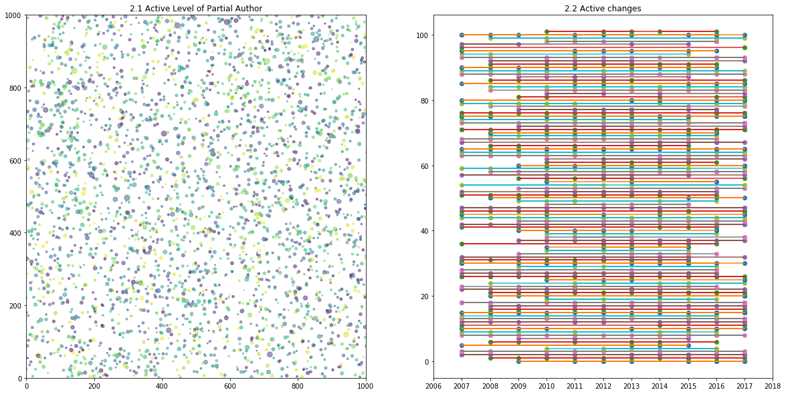

# <center> 2017 机器学习第三次作业</center>
| 姓名    |    分工   | 工作量 |
|--------|-------------|------|
| 张尉东  | 任务1,2      |33.33%|
| 王海燕  | 任务1,2      |33.33%|
| 张明悦  | 任务1,2      |33.33%|

## 1. 概念定义及数据预处理

### (a.) 概念定义:    
- **活跃作者**: 我们将2007至2017年分为三段```[2007, 2011), [2011, 2015), [2015, 2018)```, 并将活跃作者定义为三个阶段都出现的作者;
- **团队**: 经常性在一起合作的学者称之为**团队**;
- **频繁团队**: 至少一起发表过3篇以上论文的团队称之为**频繁团队**.

### (b.) 数据结构定义:
定义类型```class Article```, 将数据读入内存并存放在数组```articles```中, 代码如下:


```python
class Article:
    def __init__(self, str):
        self.authors = []
        lines = str.split('\n')
        for line in lines:
            if line is '' or line is None or line == "":
                continue
            key, value = line.split('\t', 1)
            if key == 'author':
                self.authors.append(value)
            elif key == 'title':
                self.title = value
            elif key == 'year':
                self.year = int(value)
            elif key == 'Conference':
                self.conference = value
    
    def display(self):
        str = ' '.join(self.authors) + ':' + self.title + ',' + self.conference
        print(str)
    
    
def parse_article(filename):
    fin = open(filename)
    content = fin.read()
    blocks = content.split('#########')
    articles = []
    for block in blocks:
        if block is '' or block is None or block == "":
            continue
        art = Article(block)
        # art.display()
        articles.append(art)
    return articles
        
articles = parse_article('data/FilteredDBLP.txt')
```

## 2. 活跃作者挖掘
(**任务1.1**: 根据时间信息，判定哪些人依然活跃，哪些人不再活跃。)

### (a.) ***活跃作者***挖掘及存储
我们将挖掘出的活跃作者存储在一个```active_authors_years = dict()```结构体中, 其结构为:
```python
{'authorname':[year1, year2, ...]}
```

### (b.) 结果展示
- ***活跃作者***: 如表2.1所以, 我们列出了部分活跃作者;
- ***作者的活跃程度***: 如图2.1所示的散列图, 表示越活跃的作者(出现次数越多), 散列点越大;
- ***连续活跃程度***: 如图2.2所示的活动轨迹图, 我们将活跃的作者(至少出现5次以上)依据其出现的年份连成一条活跃年份图.


```python
import numpy as np
import matplotlib.pyplot as plt
import textwrap

# Fixing random state for reproducibility
np.random.seed(19680801)

def find_active_author(articles):
    # Statistics the number of author occurences and years
    author_years = dict()
    for article in articles:
        for author in article.authors:
            if author in author_years:
                author_years[author].append(article.year)
            else:
                author_years[author] = [article.year]
    active_author_years = dict()
    for idx, kv in enumerate(author_years.items()):
        key, value = kv
        if len(value) > 3 and min(value) in range(2007, 2011) and max(value) in range(2015, 2018) and np.median(value) in range(2011, 2015):
            active_author_years[key] = value
    return active_author_years

def display_active_authors(active_author_years, num):
    print("{:<33} {:<33}".format('', '表2.1 活跃作者及活跃年份'))
    print('The number of active author:',len(active_author_years))
    # formatly output the active auth, only output 50 items
    print("{:<8} {:<35} {:<10}".format('Index','Author Name','Years'))
    print("{:<8} {:<35} {:<10}".format('-----','-------------','---------'))
    for idx, kv in enumerate(active_author_years.items()):
        key, value = kv
        print("{:<8} {:<35} {:<10}".format(
            idx, key, textwrap.shorten(str(set(value)), width=50, placeholder='...')))
        if idx > num:
            print('... ...')
            break

# 1. display the active authors and their active years
active_author_years = find_active_author(articles)
display_active_authors(active_author_years, 30)

# 2. plot the ative level  
fig1 = plt.figure(figsize=(20,10))
def plot_active_level(active_author_years):
    N = len(articles)
    x = np.random.rand(N) * 3000
    y = np.random.rand(N) * 3000
    colors = np.random.rand(N)
    # 0 to 15 point radii
    area = np.pi * (15 * np.array([len(years)/100.0 for years in active_author_years.keys()]))**2

    ax1 = fig1.add_subplot(121)
    # ax1.xlim(0, 500)
    ax1.set_xlim([0, 1000])
    ax1.set_ylim([0, 1000])
    ax1.scatter(x, y, s=area, c=colors, alpha=0.5)
    ax1.set_title('2.1 Active Level of Partial Author')
    ax1.legend(numpoints=1, loc='upper left')

# 3. plot the ative changes  
def plot_active_changes(active_author_years, num):
    ax2 = fig1.add_subplot(122)
    ax2.set_title('2.2 Active changes')
    ax2.set_xlim([2006, 2018])
    years = [2006, 2007, 2008, 2009, 2010, 2011, 2012, 2013, 2014, 2015, 2016, 2017, 2018]
    ax2.set_xticks(years)
    
    for idx, active_author_years in enumerate(active_author_years.items()):
        author, years = active_author_years
        ax2.plot(years, np.ones(len(years)) * idx, 'o', years, np.ones(len(years)) * idx, '-')
        if (idx > num):
            break

plot_active_level(active_author_years)
plot_active_changes(active_author_years, 100)
plt.show()
```

                                      表2.1 活跃作者及活跃年份                   
    The number of active author: 1326
    Index    Author Name                         Years     
    -----    -------------                       --------- 
    0        Fatih Murat Porikli                 {2008, 2014, 2015}
    1        Lars Schmidt-Thieme                 {2009, 2011, 2012, 2014, 2015}
    2        W. Bruce Croft                      {2016, 2017, 2007, 2008, 2009, 2010, 2011,...
    3        Hankz Hankui Zhuo                   {2017, 2009, 2011, 2012, 2013, 2015}
    4        Kilian Q. Weinberger                {2016, 2017, 2008, 2010, 2011, 2012, 2013,...
    5        Chang Huang                         {2016, 2009, 2010, 2011, 2012, 2015}
    6        Vernon Asuncion                     {2017, 2010, 2012, 2014}
    7        Yizhou Sun                          {2016, 2017, 2009, 2010, 2012, 2013, 2014, 2015}
    8        Arnold W. M. Smeulders              {2016, 2017, 2007, 2008, 2009, 2012, 2014, 2015}
    9        Derek Hoiem                         {2016, 2007, 2008, 2009, 2010, 2011, 2012,...
    10       Francesco Bonchi                    {2016, 2008, 2010, 2011, 2012, 2013, 2014, 2015}
    11       Andrea Fusiello                     {2016, 2010, 2014, 2008}
    12       H. Sebastian Seung                  {2016, 2017, 2008, 2009, 2010, 2011, 2015}
    13       Jaime G. Carbonell                  {2016, 2017, 2007, 2008, 2009, 2010, 2011,...
    14       Jussi Rintanen                      {2017, 2007, 2008, 2011, 2013, 2014, 2015}
    15       Edith Elkind                        {2016, 2017, 2007, 2008, 2009, 2010, 2011,...
    16       Francesc Moreno-Noguer              {2017, 2009, 2010, 2011, 2012, 2013, 2014, 2015}
    17       Tomás Lozano-Pérez                  {2016, 2007, 2010, 2011, 2013, 2014, 2015}
    18       Philip S. Yu                        {2016, 2017, 2007, 2008, 2009, 2010, 2011,...
    19       Piotr Dollár                        {2016, 2017, 2007, 2009, 2010, 2012, 2013,...
    20       Weiming Hu                          {2016, 2017, 2008, 2010, 2011, 2012, 2013,...
    21       Hamed Pirsiavash                    {2016, 2017, 2007, 2009, 2011, 2012, 2014, 2015}
    22       Wei Gao                             {2016, 2017, 2007, 2009, 2010, 2011, 2013,...
    23       Madhav V. Marathe                   {2008, 2017, 2014, 2007}
    24       Dean P. Foster                      {2016, 2007, 2011, 2012, 2013, 2014, 2015}
    25       Charu C. Aggarwal                   {2017, 2007, 2009, 2010, 2011, 2013, 2014, 2015}
    26       Ping Tan                            {2016, 2017, 2007, 2008, 2009, 2010, 2012,...
    27       Wouter M. Koolen                    {2016, 2017, 2008, 2010, 2011, 2012, 2013,...
    28       Chen Zhang                          {2017, 2010, 2007, 2014, 2015}
    29       Wei Zeng                            {2016, 2017, 2008, 2011, 2013, 2014}
    30       Lirong Xia                          {2016, 2017, 2007, 2008, 2009, 2010, 2011,...
    31       Daniel Borrajo                      {2016, 2007, 2008, 2011, 2013, 2015}
    ... ...





## 3. 频繁项挖掘
(**任务1.2**: 经常性在一起合作的 学者，将之称为‘团队’, 根据研究者合作发表论文次数为根据 进行频繁模式挖掘，找出三个人以上的‘团队’.)

### (a.) 频繁项挖掘: 找出支持度support>=5的所有学者


```python
from pymining import itemmining

def display_active_teams(active_teams, minimum_author, records):
    print("{:<28} {:<33}".format('', '表3.1 人数>=1, 合作次数>=5的团队'))
    print('The number of active teams:',len(active_teams))
    # formatly output the active auth, only output 50 items
    print("{:<8} {:<35}".format('Index','Author Name'))
    print("{:<8} {:<35}".format('-----','-------------','---------'))
    counter = 0
    for idx,authors in enumerate(active_teams):
        if len(authors) >= minimum_author:  
            print("{:<8} {:<35}".format(counter, ', '.join(authors)))
            counter += 1
        if counter > records:
            print('... ...')
            break

authors = [article.authors for article in articles]
relim_input = itemmining.get_relim_input(authors)
report = itemmining.relim(relim_input, min_support=5)
display_active_teams(report, 1, 10)
```

                                 表3.1 人数>=1, 合作次数>=5的团队           
    The number of active teams: 5985
    Index    Author Name                        
    -----    -------------                      
    0        Ming Yang                          
    1        Supun Samarasekera                 
    2        Fei-Fei Li, Vignesh Ramanathan     
    3        XuanLong Nguyen                    
    4        Kun Zhou                           
    5        Neil D. Lawrence                   
    6        Jörg H. Kappes                     
    7        Shireen Y. Elhabian                
    8        Subhransu Maji                     
    9        Yoram Bachrach, Yoad Lewenberg     
    10       Sang-Wook Kim                      
    ... ...


### (b.) 找出合作者个数>=3的所有合作团队


```python
display_active_teams(report, 3, 10)
```

                                      表3.2 人数>=3, 合作次数>=5的团队           
    The number of active teams: 5985
    Index    Author Name                        
    -----    -------------                      
    0        Furu Wei, Ming Zhou 0001, Li Dong  
    1        Jun Xu, Jiafeng Guo, Xueqi Cheng, Yanyan Lan
    2        Horst Bischof, Amir Saffari, Christian Leistner
    3        Jiawei Han 0001, Chao Zhang, Quan Yuan
    4        Kate Saenko, Trevor Darrell, Marcus Rohrbach
    5        Xiaoqian Wang, Feiping Nie, Heng Huang
    6        Justin Zobel, Alistair Moffat, William Webber
    7        Michael R. Lyu, Haiqin Yang, Irwin King
    8        Kuldeep S. Meel, Supratik Chakraborty, Moshe Y. Vardi
    9        Min Zhang, Shaoping Ma, Yiqun Liu  
    10       Shiqiang Yang, Peng Cui, Fei Wang 0001
    ... ...


## 4. 主题挖掘
(**任务2.1**: 先定出主题词， 然后根据每个‘团队’发表的论文的情况，提炼出这个团队最常涉猎的主题。)

### (a.) 根据Latent Dirichlet allocation(LDA)主题模型训练出所有的模型:
我们将主题数设置为20, 经过LDA模型聚类, 我们得到了如表4.1所示的模型, 及其代表性的词.


```python
from nltk.tokenize import RegexpTokenizer
from stop_words import get_stop_words
from nltk.stem.porter import PorterStemmer
from gensim import corpora, models
import gensim

def train_ldamodel(articles):
    tokenizer = RegexpTokenizer(r'\w+')

    # create English stop words list
    en_stop = get_stop_words('en')

    # Create p_stemmer of class PorterStemmer
    p_stemmer = PorterStemmer()

    # compile sample documents into a list
    titles = [article.title for article in articles]
    doc_set = []
    for title in titles:
        doc_set.append(title)

    # list for tokenized documents in loop
    texts = []

    # loop through document list
    for i in doc_set:
        # clean and tokenize document string
        raw = i.lower()
        tokens = tokenizer.tokenize(raw)

        # remove stop words from tokens
        stopped_tokens = [i for i in tokens if not i in en_stop]

        # stem tokens
        stemmed_tokens = [p_stemmer.stem(i) for i in stopped_tokens]

        # add tokens to list
        texts.append(stemmed_tokens)

    # turn our tokenized documents into a id <-> term dictionary
    dictionary = corpora.Dictionary(texts)

    # convert tokenized documents into a document-term matrix
    corpus = [dictionary.doc2bow(text) for text in texts]

    # generate LDA model
    ldamodel = gensim.models.ldamodel.LdaModel(
        corpus, num_topics=20, id2word = dictionary, passes=20)
    return corpus, ldamodel

corpus, ldamodel = train_ldamodel(articles)
```

### (b.) 确定主题及主题词


```python
# ldamodel = train_ldamodel(articles)
ldamodel.print_topics()
ldamodel.show_topic(10)
print("{:<33} {:<33}".format('', '表4.1 20个主题及主题下的关键词'))
for i in range(2):
    topic_terms1 = ldamodel.show_topic(i * 5)
    topic_terms2 = ldamodel.show_topic(i * 5 + 1)
    topic_terms3 = ldamodel.show_topic(i * 5 + 2)
    topic_terms4 = ldamodel.show_topic(i * 5 + 3)
    topic_terms5 = ldamodel.show_topic(i * 5 + 4)
    #print(topic_terms1)
    print("{:<20} {:<22} {:<20} {:<20} {:<22}".format('Topic-' + str(i * 5), 
        'Topic-' + str(i * 5 + 1), 'Topic-'+ str(i * 5 + 2), 'Topic-'+ 
        str(i * 5 + 3), 'Topic-'+ str(i * 5 + 4)))
    print("{:<20} {:<22} {:<20} {:<20} {:<22}".format(
        '----------','----------','----------','----------','----------'))
    print("{:<12} {:<8} {:<12} {:<8} {:<12} {:<8} {:<12} {:<8} {:<12} {:<8}".format(
        'Term','Prob','Term','Prob','Term','Prob','Term','Prob','Term','Prob',))
    print("{:<12} {:<8} {:<12} {:<8} {:<12} {:<8} {:<12} {:<8} {:<12} {:<8}".format(
        '-----','-----','-----','-----','-----','-----','-----','-----','-----','-----',))
    for term_prob1, term_prob2, term_prob3, term_prob4, term_prob5 in zip(
        topic_terms1, topic_terms2, topic_terms3, topic_terms4, topic_terms5):
        # term1, prob1 = term_prob1
        print("{:<12} {:<8} {:<12} {:<8} {:<12} {:<8} {:<12} {:<8} {:<12} {:<8}".format(
            term_prob1[0], "{0:.3f}".format(term_prob1[1]), term_prob2[0], "{0:.3f}".format(term_prob2[1]), 
            term_prob3[0], "{0:.3f}".format(term_prob3[1]), term_prob4[0], "{0:.3f}".format(term_prob4[1]), 
            term_prob5[0], "{0:.3f}".format(term_prob5[1])))
    if i== 0:
        print('\n')
```

                                      表4.1 20个主题及主题下的关键词               
    Topic-0              Topic-1                Topic-2              Topic-3              Topic-4               
    ----------           ----------             ----------           ----------           ----------            
    Term         Prob     Term         Prob     Term         Prob     Term         Prob     Term         Prob    
    -----        -----    -----        -----    -----        -----    -----        -----    -----        -----   
    imag         0.081    action       0.068    model        0.058    person       0.038    game         0.073   
    object       0.069    human        0.051    infer        0.049    hierarch     0.037    random       0.040   
    video        0.048    interact     0.043    probabilist  0.043    model        0.036    field        0.034   
    segment      0.042    robot        0.033    abstract     0.039    imag         0.030    effect       0.031   
    detect       0.040    new          0.030    bayesian     0.038    resolut      0.026    discrimin    0.031   
    use          0.030    pattern      0.030    space        0.032    learn        0.025    gener        0.027   
    track        0.030    mine         0.029    extend       0.029    use          0.024    strategi     0.025   
    activ        0.030    prefer       0.027    weight       0.023    represent    0.024    condit       0.025   
    recognit     0.028    depth        0.026    latent       0.022    identif      0.023    direct       0.020   
    semant       0.026    understand   0.025    variat       0.019    regress      0.022    annot        0.020   
    
    
    Topic-5              Topic-6                Topic-7              Topic-8              Topic-9               
    ----------           ----------             ----------           ----------           ----------            
    Term         Prob     Term         Prob     Term         Prob     Term         Prob     Term         Prob    
    -----        -----    -----        -----    -----        -----    -----        -----    -----        -----   
    process      0.068    tempor       0.069    toward       0.053    featur       0.049    larg         0.062   
    spars        0.055    data         0.027    ontolog      0.038    select       0.046    scale        0.061   
    intellig     0.035    detect       0.027    point        0.030    embed        0.036    program      0.054   
    gaussian     0.035    driven       0.027    attribut     0.027    learn        0.032    learn        0.045   
    theori       0.028    measur       0.022    time         0.026    relat        0.028    set          0.041   
    complet      0.028    chang        0.021    maxim        0.025    unsupervis   0.027    machin       0.035   
    confer       0.024    dens         0.019    enhanc       0.024    base         0.025    integr       0.026   
    workshop     0.020    test         0.017    transform    0.022    text         0.023    metric       0.024   
    ijcai        0.020    energi       0.017    use          0.022    model        0.022    spatial      0.021   
    mixtur       0.020    spatio       0.017    error        0.015    imag         0.021    classifi     0.021   


### (c.) 确定团队经常涉猎的主题
使用映射 `作者<--->标题<--->主题` 将作者经常所涉猎的主题进行关联:


```python
topics = ldamodel.get_topics()
# print(ldamodel.show_topic(19, topn=3))
doc2topics = ldamodel.get_document_topics(corpus)

print("{:<25} {:<35}".format('', '表4.2 研究团队经常涉猎的主题及其主题下的关键词'))
print("{:<50} {:<22} {:<35}".format('Team memebers', 'Topic IDs', 'Topic Terms'))
print("{:<50} {:<22} {:<35}".format('----------------','---------', '-----------------------'))
for idx, article in enumerate(articles[:10]):
    max_prob_topic = 0
    max_prob = 0.0
    # Find the topic_id with maximum probability
    topic_id_str = ""
    for topic_id, prob in doc2topics[idx]:
        topic_id_str += str(topic_id) + ","
        if prob > max_prob:
            max_prob = prob
            max_prob_topic = topic_id
    topic_terms = [topic_prob[0] for topic_prob in ldamodel.show_topic(max_prob_topic, topn=3)]
    print("{:<50} {:<22} {:<35}".format(
        textwrap.shorten(', '.join(article.authors), width=50, placeholder="..."), 
        topic_id_str, ', '.join(topic_terms)))
```

                              表4.2 研究团队经常涉猎的主题及其主题下的关键词          
    Team memebers                                      Topic IDs              Topic Terms                        
    ----------------                                   ---------              -----------------------            
    Miroslaw Truszczynski, Stefan Woltran              2,9,11,18,             recognit, face, languag            
    Guibing Guo, Jie Zhang, Neil Yorke-Smith           3,8,14,15,17,          network, deep, neural              
    Xinwang Liu, Yong Dou, Jianping Yin, Lei Wang...   10,14,17,18,           learn, decis, tree                 
    Mickey Brautbar, Michael J. Kearns, Umar Syed      4,6,9,12,13,16,17,18,  logic, cluster, base               
    Shirin Sohrabi, Anton V. Riabov, Octavian Udrea    2,6,16,18,             logic, cluster, base               
    Maximilian Nickel, Lorenzo Rosasco, Tomaso A....   6,8,13,18,             featur, select, embed              
    Kyle Lund, Sam Dietrich, Scott Chow, James C....   2,6,9,16,              tempor, data, detect               
    Leandro Soriano Marcolino, Boian Kolev, Samori...  6,11,14,17,            tempor, data, detect               
    Russell Bent, Alan Berscheid, G. Loren Toole       2,3,15,16,             plan, time, motion                 
    Vibhav Gogate, Rina Dechter                        2,10,18,               logic, cluster, base               


## 5. 关联规则及序列规则挖掘: 团队和主题多是会随着时间而动态变化
(**任务2.2**: 根据自己所定的时间段(五年，三年，两年或是一年)描述团队的构成状况以及其研究主题的变化情况。)

### (a.) 团队构成状况的变化
- **使用频繁项挖掘(Frequent Item Set Mining)**:首先找出至少出现5次, 两个或两个以上作者的组合;
- **使用关联规则挖掘(Association Rules Mining)**: 在两个人组合的基础之上, 根据年份变化观察团队的变化.


```python
# 1. 找出至少出现5次, 两个或两个以上作者的组合
def find_team_with2(active_teams, minimum_author, records):
    counter = 0
    for idx,authors in enumerate(active_teams):
        if len(authors) >= minimum_author:  
            counter += 1
        if counter > records:
            print('... ...')
            break

# 2. 在二维图上画出团队结构随年份变化的曲线
def plot_teammember_changes():
    pass

from pymining import itemmining, assocrules, perftesting
# transactions = perftesting.get_default_transactions()
# relim_input = itemmining.get_relim_input(transactions)
# item_sets = itemmining.relim(relim_input, min_support=2)
rules = assocrules.mine_assoc_rules(report, min_support=5, min_confidence=0.9)
rules
```


    [(frozenset({'Eric Reiman', 'Jing Li', 'Kewei Chen', 'Teresa Wu'}),
      frozenset({'Jieping Ye'}),
      5,
      1.0),
     (frozenset({'Eric Reiman', 'Jing Li', 'Teresa Wu'}),
      frozenset({'Jieping Ye', 'Kewei Chen'}),
      5,
      1.0),
     (frozenset({'Eric Reiman', 'Jing Li'}),
      frozenset({'Jieping Ye', 'Kewei Chen', 'Teresa Wu'}),
      5,
      1.0),
     (frozenset({'Eric Reiman'}),
      frozenset({'Jieping Ye', 'Jing Li', 'Kewei Chen', 'Teresa Wu'}),
      5,
      1.0),
     (frozenset({'Jing Li', 'Teresa Wu'}),
      frozenset({'Eric Reiman', 'Jieping Ye', 'Kewei Chen'}),
      5,
      1.0),
     (frozenset({'Teresa Wu'}),
      frozenset({'Eric Reiman', 'Jieping Ye', 'Jing Li', 'Kewei Chen'}),
      5,
      1.0),
     (frozenset({'Eric Reiman', 'Teresa Wu'}),
      frozenset({'Jieping Ye', 'Jing Li', 'Kewei Chen'}),
      5,
      1.0),
     (frozenset({'Eric Reiman', 'Kewei Chen', 'Teresa Wu'}),
      frozenset({'Jieping Ye', 'Jing Li'}),
      5,
      1.0),
     (frozenset({'Eric Reiman', 'Kewei Chen'}),
      frozenset({'Jieping Ye', 'Jing Li', 'Teresa Wu'}),
      5,
      1.0),
     (frozenset({'Kewei Chen'}),
      frozenset({'Eric Reiman', 'Jieping Ye', 'Jing Li', 'Teresa Wu'}),
      5,
      1.0),
     (frozenset({'Kewei Chen', 'Teresa Wu'}),
      frozenset({'Eric Reiman', 'Jieping Ye', 'Jing Li'}),
      5,
      1.0),
     (frozenset({'Jing Li', 'Kewei Chen', 'Teresa Wu'}),
      frozenset({'Eric Reiman', 'Jieping Ye'}),
      5,
      1.0),
     (frozenset({'Jing Li', 'Kewei Chen'}),
      frozenset({'Eric Reiman', 'Jieping Ye', 'Teresa Wu'}),
      5,
      1.0),
     (frozenset({'Eric Reiman', 'Jing Li', 'Kewei Chen'}),
      frozenset({'Jieping Ye', 'Teresa Wu'}),
      5,
      1.0),
     (frozenset({'Eric Reiman', 'Jieping Ye', 'Jing Li', 'Teresa Wu'}),
      frozenset({'Kewei Chen'}),
      5,
      1.0),
     (frozenset({'Eric Reiman', 'Jieping Ye', 'Teresa Wu'}),
      frozenset({'Jing Li', 'Kewei Chen'}),
      5,
      1.0),
     (frozenset({'Eric Reiman', 'Jieping Ye'}),
      frozenset({'Jing Li', 'Kewei Chen', 'Teresa Wu'}),
      5,
      1.0),
     (frozenset({'Jieping Ye', 'Teresa Wu'}),
      frozenset({'Eric Reiman', 'Jing Li', 'Kewei Chen'}),
      5,
      1.0),
     (frozenset({'Jieping Ye', 'Jing Li', 'Teresa Wu'}),
      frozenset({'Eric Reiman', 'Kewei Chen'}),
      5,
      1.0),
     (frozenset({'Jieping Ye', 'Jing Li'}),
      frozenset({'Eric Reiman', 'Kewei Chen', 'Teresa Wu'}),
      5,
      1.0),
     (frozenset({'Eric Reiman', 'Jieping Ye', 'Jing Li'}),
      frozenset({'Kewei Chen', 'Teresa Wu'}),
      5,
      1.0),
     (frozenset({'Eric Reiman', 'Jieping Ye', 'Kewei Chen', 'Teresa Wu'}),
      frozenset({'Jing Li'}),
      5,
      1.0),
     (frozenset({'Jieping Ye', 'Kewei Chen', 'Teresa Wu'}),
      frozenset({'Eric Reiman', 'Jing Li'}),
      5,
      1.0),
     (frozenset({'Jieping Ye', 'Kewei Chen'}),
      frozenset({'Eric Reiman', 'Jing Li', 'Teresa Wu'}),
      5,
      1.0),
     (frozenset({'Eric Reiman', 'Jieping Ye', 'Kewei Chen'}),
      frozenset({'Jing Li', 'Teresa Wu'}),
      5,
      1.0),
     (frozenset({'Jieping Ye', 'Jing Li', 'Kewei Chen', 'Teresa Wu'}),
      frozenset({'Eric Reiman'}),
      5,
      1.0),
     (frozenset({'Jieping Ye', 'Jing Li', 'Kewei Chen'}),
      frozenset({'Eric Reiman', 'Teresa Wu'}),
      5,
      1.0),
     (frozenset({'Eric Reiman', 'Jieping Ye', 'Jing Li', 'Kewei Chen'}),
      frozenset({'Teresa Wu'}),
      5,
      1.0),
     (frozenset({'Gui-Rong Xue', 'Qiang Yang 0001', 'Wenyuan Dai'}),
      frozenset({'Yong Yu'}),
      5,
      1.0),
     (frozenset({'Qiang Yang 0001', 'Wenyuan Dai'}),
      frozenset({'Gui-Rong Xue', 'Yong Yu'}),
      5,
      1.0),
     (frozenset({'Gui-Rong Xue', 'Wenyuan Dai'}),
      frozenset({'Qiang Yang 0001', 'Yong Yu'}),
      5,
      1.0),
     (frozenset({'Qiang Yang 0001', 'Wenyuan Dai', 'Yong Yu'}),
      frozenset({'Gui-Rong Xue'}),
      5,
      1.0),
     (frozenset({'Wenyuan Dai', 'Yong Yu'}),
      frozenset({'Gui-Rong Xue', 'Qiang Yang 0001'}),
      5,
      1.0),
     (frozenset({'Gui-Rong Xue', 'Wenyuan Dai', 'Yong Yu'}),
      frozenset({'Qiang Yang 0001'}),
      5,
      1.0),
     (frozenset({'Jiafeng Guo', 'Shengxian Wan', 'Xueqi Cheng'}),
      frozenset({'Yanyan Lan'}),
      5,
      1.0),
     (frozenset({'Shengxian Wan', 'Xueqi Cheng'}),
      frozenset({'Jiafeng Guo', 'Yanyan Lan'}),
      5,
      1.0),
     (frozenset({'Shengxian Wan'}),
      frozenset({'Jiafeng Guo', 'Xueqi Cheng', 'Yanyan Lan'}),
      5,
      1.0),
     (frozenset({'Jiafeng Guo', 'Shengxian Wan'}),
      frozenset({'Xueqi Cheng', 'Yanyan Lan'}),
      5,
      1.0),
     (frozenset({'Shengxian Wan', 'Xueqi Cheng', 'Yanyan Lan'}),
      frozenset({'Jiafeng Guo'}),
      5,
      1.0),
     (frozenset({'Shengxian Wan', 'Yanyan Lan'}),
      frozenset({'Jiafeng Guo', 'Xueqi Cheng'}),
      5,
      1.0),
     (frozenset({'Jiafeng Guo', 'Shengxian Wan', 'Yanyan Lan'}),
      frozenset({'Xueqi Cheng'}),
      5,
      1.0),
     (frozenset({'Deng Cai', 'Yueting Zhuang', 'Zhou Zhao'}),
      frozenset({'Xiaofei He'}),
      5,
      1.0),
     (frozenset({'Deng Cai', 'Zhou Zhao'}),
      frozenset({'Xiaofei He', 'Yueting Zhuang'}),
      5,
      1.0),
     (frozenset({'Deng Cai', 'Yueting Zhuang'}),
      frozenset({'Xiaofei He', 'Zhou Zhao'}),
      5,
      1.0),
     (frozenset({'Deng Cai', 'Xiaofei He', 'Zhou Zhao'}),
      frozenset({'Yueting Zhuang'}),
      5,
      1.0),
     (frozenset({'Deng Cai', 'Xiaofei He', 'Yueting Zhuang'}),
      frozenset({'Zhou Zhao'}),
      5,
      1.0),
     (frozenset({'Shiyu Chang', 'Yingzhen Yang', 'Zhangyang Wang'}),
      frozenset({'Thomas S. Huang'}),
      7,
      1.0),
     (frozenset({'Shiyu Chang', 'Zhangyang Wang'}),
      frozenset({'Thomas S. Huang', 'Yingzhen Yang'}),
      7,
      1.0),
     (frozenset({'Shiyu Chang', 'Yingzhen Yang'}),
      frozenset({'Thomas S. Huang', 'Zhangyang Wang'}),
      7,
      1.0),
     (frozenset({'Shiyu Chang', 'Thomas S. Huang', 'Zhangyang Wang'}),
      frozenset({'Yingzhen Yang'}),
      7,
      1.0),
     (frozenset({'Shiyu Chang', 'Thomas S. Huang', 'Yingzhen Yang'}),
      frozenset({'Zhangyang Wang'}),
      7,
      1.0),
     (frozenset({'Eric Reiman', 'Jing Li', 'Kewei Chen'}),
      frozenset({'Teresa Wu'}),
      5,
      1.0),
     (frozenset({'Eric Reiman', 'Kewei Chen'}),
      frozenset({'Jing Li', 'Teresa Wu'}),
      5,
      1.0),
     (frozenset({'Kewei Chen'}),
      frozenset({'Eric Reiman', 'Jing Li', 'Teresa Wu'}),
      5,
      1.0),
     (frozenset({'Eric Reiman'}),
      frozenset({'Jing Li', 'Kewei Chen', 'Teresa Wu'}),
      5,
      1.0),
     (frozenset({'Eric Reiman', 'Jing Li'}),
      frozenset({'Kewei Chen', 'Teresa Wu'}),
      5,
      1.0),
     (frozenset({'Jing Li', 'Kewei Chen'}),
      frozenset({'Eric Reiman', 'Teresa Wu'}),
      5,
      1.0),
     (frozenset({'Eric Reiman', 'Kewei Chen', 'Teresa Wu'}),
      frozenset({'Jing Li'}),
      5,
      1.0),
     (frozenset({'Eric Reiman', 'Teresa Wu'}),
      frozenset({'Jing Li', 'Kewei Chen'}),
      5,
      1.0),
     (frozenset({'Teresa Wu'}),
      frozenset({'Eric Reiman', 'Jing Li', 'Kewei Chen'}),
      5,
      1.0),
     (frozenset({'Kewei Chen', 'Teresa Wu'}),
      frozenset({'Eric Reiman', 'Jing Li'}),
      5,
      1.0),
     (frozenset({'Eric Reiman', 'Jing Li', 'Teresa Wu'}),
      frozenset({'Kewei Chen'}),
      5,
      1.0),
     (frozenset({'Jing Li', 'Teresa Wu'}),
      frozenset({'Eric Reiman', 'Kewei Chen'}),
      5,
      1.0),
     (frozenset({'Jing Li', 'Kewei Chen', 'Teresa Wu'}),
      frozenset({'Eric Reiman'}),
      5,
      1.0),
     (frozenset({'Eric Reiman', 'Jing Li', 'Kewei Chen'}),
      frozenset({'Jieping Ye'}),
      5,
      1.0),
     (frozenset({'Eric Reiman', 'Jing Li'}),
      frozenset({'Jieping Ye', 'Kewei Chen'}),
      5,
      1.0),
     (frozenset({'Eric Reiman'}),
      frozenset({'Jieping Ye', 'Jing Li', 'Kewei Chen'}),
      5,
      1.0),
     (frozenset({'Eric Reiman', 'Kewei Chen'}),
      frozenset({'Jieping Ye', 'Jing Li'}),
      5,
      1.0),
     (frozenset({'Kewei Chen'}),
      frozenset({'Eric Reiman', 'Jieping Ye', 'Jing Li'}),
      5,
      1.0),
     (frozenset({'Jing Li', 'Kewei Chen'}),
      frozenset({'Eric Reiman', 'Jieping Ye'}),
      5,
      1.0),
     (frozenset({'Eric Reiman', 'Jieping Ye', 'Jing Li'}),
      frozenset({'Kewei Chen'}),
      5,
      1.0),
     (frozenset({'Eric Reiman', 'Jieping Ye'}),
      frozenset({'Jing Li', 'Kewei Chen'}),
      5,
      1.0),
     (frozenset({'Jieping Ye', 'Jing Li'}),
      frozenset({'Eric Reiman', 'Kewei Chen'}),
      5,
      1.0),
     (frozenset({'Eric Reiman', 'Jieping Ye', 'Kewei Chen'}),
      frozenset({'Jing Li'}),
      5,
      1.0),
     (frozenset({'Jieping Ye', 'Kewei Chen'}),
      frozenset({'Eric Reiman', 'Jing Li'}),
      5,
      1.0),
     (frozenset({'Jieping Ye', 'Jing Li', 'Kewei Chen'}),
      frozenset({'Eric Reiman'}),
      5,
      1.0),
     (frozenset({'Jun Xu', 'Xueqi Cheng', 'Yanyan Lan'}),
      frozenset({'Jiafeng Guo'}),
      12,
      1.0),
     (frozenset({'Jun Xu', 'Yanyan Lan'}),
      frozenset({'Jiafeng Guo', 'Xueqi Cheng'}),
      12,
      1.0),
     (frozenset({'Jun Xu'}),
      frozenset({'Jiafeng Guo', 'Xueqi Cheng', 'Yanyan Lan'}),
      12,
      0.9230769230769231),
     (frozenset({'Jun Xu', 'Xueqi Cheng'}),
      frozenset({'Jiafeng Guo', 'Yanyan Lan'}),
      12,
      1.0),
     (frozenset({'Jiafeng Guo', 'Jun Xu', 'Yanyan Lan'}),
      frozenset({'Xueqi Cheng'}),
      12,
      1.0),
     (frozenset({'Jiafeng Guo', 'Jun Xu'}),
      frozenset({'Xueqi Cheng', 'Yanyan Lan'}),
      12,
      1.0),
     (frozenset({'Jiafeng Guo', 'Jun Xu', 'Xueqi Cheng'}),
      frozenset({'Yanyan Lan'}),
      12,
      1.0),
     (frozenset({'Nicholas Mattei', 'Serge Gaspers', 'Toby Walsh'}),
      frozenset({'Haris Aziz 0001'}),
      6,
      1.0),
     (frozenset({'Nicholas Mattei', 'Serge Gaspers'}),
      frozenset({'Haris Aziz 0001', 'Toby Walsh'}),
      6,
      1.0),
     (frozenset({'Haris Aziz 0001', 'Nicholas Mattei', 'Serge Gaspers'}),
      frozenset({'Toby Walsh'}),
      6,
      1.0),
     (frozenset({'Jieping Ye', 'Jing Li', 'Teresa Wu'}),
      frozenset({'Kewei Chen'}),
      5,
      1.0),
     (frozenset({'Jieping Ye', 'Jing Li'}),
      frozenset({'Kewei Chen', 'Teresa Wu'}),
      5,
      1.0),
     (frozenset({'Jieping Ye', 'Teresa Wu'}),
      frozenset({'Jing Li', 'Kewei Chen'}),
      5,
      1.0),
     (frozenset({'Teresa Wu'}),
      frozenset({'Jieping Ye', 'Jing Li', 'Kewei Chen'}),
      5,
      1.0),
     (frozenset({'Jing Li', 'Teresa Wu'}),
      frozenset({'Jieping Ye', 'Kewei Chen'}),
      5,
      1.0),
     (frozenset({'Jieping Ye', 'Jing Li', 'Kewei Chen'}),
      frozenset({'Teresa Wu'}),
      5,
      1.0),
     (frozenset({'Jieping Ye', 'Kewei Chen'}),
      frozenset({'Jing Li', 'Teresa Wu'}),
      5,
      1.0),
     (frozenset({'Kewei Chen'}),
      frozenset({'Jieping Ye', 'Jing Li', 'Teresa Wu'}),
      5,
      1.0),
     (frozenset({'Jing Li', 'Kewei Chen'}),
      frozenset({'Jieping Ye', 'Teresa Wu'}),
      5,
      1.0),
     (frozenset({'Jieping Ye', 'Kewei Chen', 'Teresa Wu'}),
      frozenset({'Jing Li'}),
      5,
      1.0),
     (frozenset({'Kewei Chen', 'Teresa Wu'}),
      frozenset({'Jieping Ye', 'Jing Li'}),
      5,
      1.0),
     (frozenset({'Jing Li', 'Kewei Chen', 'Teresa Wu'}),
      frozenset({'Jieping Ye'}),
      5,
      1.0),
     (frozenset({'Houqiang Li', 'Tao Mei', 'Yingwei Pan'}),
      frozenset({'Ting Yao'}),
      7,
      1.0),
     (frozenset({'Houqiang Li', 'Tao Mei'}),
      frozenset({'Ting Yao', 'Yingwei Pan'}),
      7,
      1.0),
     (frozenset({'Houqiang Li', 'Yingwei Pan'}),
      frozenset({'Tao Mei', 'Ting Yao'}),
      7,
      1.0),
     (frozenset({'Houqiang Li', 'Tao Mei', 'Ting Yao'}),
      frozenset({'Yingwei Pan'}),
      7,
      1.0),
     (frozenset({'Houqiang Li', 'Ting Yao'}),
      frozenset({'Tao Mei', 'Yingwei Pan'}),
      7,
      1.0),
     (frozenset({'Houqiang Li', 'Ting Yao', 'Yingwei Pan'}),
      frozenset({'Tao Mei'}),
      7,
      1.0),
     (frozenset({'Franco Maria Nardini',
                 'Raffaele Perego',
                 'Salvatore Orlando 0001'}),
      frozenset({'Claudio Lucchese'}),
      5,
      1.0),
     (frozenset({'Franco Maria Nardini', 'Salvatore Orlando 0001'}),
      frozenset({'Claudio Lucchese', 'Raffaele Perego'}),
      5,
      1.0),
     (frozenset({'Claudio Lucchese',
                 'Franco Maria Nardini',
                 'Salvatore Orlando 0001'}),
      frozenset({'Raffaele Perego'}),
      5,
      1.0),
     (frozenset({'Eric Reiman', 'Jing Li', 'Teresa Wu'}),
      frozenset({'Jieping Ye'}),
      5,
      1.0),
     (frozenset({'Eric Reiman', 'Teresa Wu'}),
      frozenset({'Jieping Ye', 'Jing Li'}),
      5,
      1.0),
     (frozenset({'Eric Reiman'}),
      frozenset({'Jieping Ye', 'Jing Li', 'Teresa Wu'}),
      5,
      1.0),
     (frozenset({'Teresa Wu'}),
      frozenset({'Eric Reiman', 'Jieping Ye', 'Jing Li'}),
      5,
      1.0),
     (frozenset({'Jing Li', 'Teresa Wu'}),
      frozenset({'Eric Reiman', 'Jieping Ye'}),
      5,
      1.0),
     (frozenset({'Eric Reiman', 'Jing Li'}),
      frozenset({'Jieping Ye', 'Teresa Wu'}),
      5,
      1.0),
     (frozenset({'Eric Reiman', 'Jieping Ye', 'Teresa Wu'}),
      frozenset({'Jing Li'}),
      5,
      1.0),
     (frozenset({'Jieping Ye', 'Teresa Wu'}),
      frozenset({'Eric Reiman', 'Jing Li'}),
      5,
      1.0),
     (frozenset({'Eric Reiman', 'Jieping Ye'}),
      frozenset({'Jing Li', 'Teresa Wu'}),
      5,
      1.0),
     (frozenset({'Jieping Ye', 'Jing Li', 'Teresa Wu'}),
      frozenset({'Eric Reiman'}),
      5,
      1.0),
     (frozenset({'Jieping Ye', 'Jing Li'}),
      frozenset({'Eric Reiman', 'Teresa Wu'}),
      5,
      1.0),
     (frozenset({'Eric Reiman', 'Jieping Ye', 'Jing Li'}),
      frozenset({'Teresa Wu'}),
      5,
      1.0),
     (frozenset({'Qi Meng', 'Tie-Yan Liu', 'Wei Chen'}),
      frozenset({'Taifeng Wang'}),
      5,
      1.0),
     (frozenset({'Qi Meng', 'Tie-Yan Liu'}),
      frozenset({'Taifeng Wang', 'Wei Chen'}),
      5,
      1.0),
     (frozenset({'Qi Meng'}),
      frozenset({'Taifeng Wang', 'Tie-Yan Liu', 'Wei Chen'}),
      5,
      1.0),
     (frozenset({'Qi Meng', 'Wei Chen'}),
      frozenset({'Taifeng Wang', 'Tie-Yan Liu'}),
      5,
      1.0),
     (frozenset({'Qi Meng', 'Taifeng Wang', 'Tie-Yan Liu'}),
      frozenset({'Wei Chen'}),
      5,
      1.0),
     (frozenset({'Qi Meng', 'Taifeng Wang'}),
      frozenset({'Tie-Yan Liu', 'Wei Chen'}),
      5,
      1.0),
     (frozenset({'Qi Meng', 'Taifeng Wang', 'Wei Chen'}),
      frozenset({'Tie-Yan Liu'}),
      5,
      1.0),
     (frozenset({'Taifeng Wang', 'Wei Chen'}),
      frozenset({'Qi Meng', 'Tie-Yan Liu'}),
      5,
      1.0),
     (frozenset({'Taifeng Wang', 'Tie-Yan Liu', 'Wei Chen'}),
      frozenset({'Qi Meng'}),
      5,
      1.0),
     (frozenset({'Chunyuan Li', 'Yunchen Pu', 'Zhe Gan'}),
      frozenset({'Lawrence Carin'}),
      5,
      1.0),
     (frozenset({'Ankit Agrawal', 'Yu Cheng', 'Yusheng Xie'}),
      frozenset({'Alok N. Choudhary'}),
      5,
      1.0),
     (frozenset({'Ankit Agrawal', 'Yu Cheng'}),
      frozenset({'Alok N. Choudhary', 'Yusheng Xie'}),
      5,
      1.0),
     (frozenset({'Yu Cheng', 'Yusheng Xie'}),
      frozenset({'Alok N. Choudhary', 'Ankit Agrawal'}),
      5,
      1.0),
     (frozenset({'Alok N. Choudhary', 'Ankit Agrawal', 'Yu Cheng'}),
      frozenset({'Yusheng Xie'}),
      5,
      1.0),
     (frozenset({'Alok N. Choudhary', 'Yu Cheng', 'Yusheng Xie'}),
      frozenset({'Ankit Agrawal'}),
      5,
      1.0),
     (frozenset({'Michael R. Lyu', 'Rong Jin', 'Zenglin Xu'}),
      frozenset({'Irwin King'}),
      5,
      1.0),
     (frozenset({'Irwin King', 'Rong Jin', 'Zenglin Xu'}),
      frozenset({'Michael R. Lyu'}),
      5,
      1.0),
     (frozenset({'Irwin King', 'Rong Jin'}),
      frozenset({'Michael R. Lyu', 'Zenglin Xu'}),
      5,
      1.0),
     (frozenset({'Irwin King', 'Michael R. Lyu', 'Rong Jin'}),
      frozenset({'Zenglin Xu'}),
      5,
      1.0),
     (frozenset({'Brian Dalessandro', 'Claudia Perlich', 'Troy Raeder'}),
      frozenset({'Foster J. Provost'}),
      5,
      1.0),
     (frozenset({'Brian Dalessandro', 'Troy Raeder'}),
      frozenset({'Claudia Perlich', 'Foster J. Provost'}),
      5,
      1.0),
     (frozenset({'Troy Raeder'}),
      frozenset({'Brian Dalessandro', 'Claudia Perlich', 'Foster J. Provost'}),
      5,
      1.0),
     (frozenset({'Claudia Perlich', 'Troy Raeder'}),
      frozenset({'Brian Dalessandro', 'Foster J. Provost'}),
      5,
      1.0),
     (frozenset({'Brian Dalessandro', 'Foster J. Provost', 'Troy Raeder'}),
      frozenset({'Claudia Perlich'}),
      5,
      1.0),
     (frozenset({'Foster J. Provost', 'Troy Raeder'}),
      frozenset({'Brian Dalessandro', 'Claudia Perlich'}),
      5,
      1.0),
     (frozenset({'Claudia Perlich', 'Foster J. Provost', 'Troy Raeder'}),
      frozenset({'Brian Dalessandro'}),
      5,
      1.0),
     (frozenset({'Jungong Han', 'Yuchen Guo', 'Yue Gao'}),
      frozenset({'Guiguang Ding'}),
      5,
      1.0),
     (frozenset({'Hongyuan Zha', 'Stephen M. Chu', 'Xiaokang Yang'}),
      frozenset({'Junchi Yan'}),
      5,
      1.0),
     (frozenset({'Stephen M. Chu', 'Xiaokang Yang'}),
      frozenset({'Hongyuan Zha', 'Junchi Yan'}),
      5,
      1.0),
     (frozenset({'Junchi Yan', 'Stephen M. Chu', 'Xiaokang Yang'}),
      frozenset({'Hongyuan Zha'}),
      5,
      1.0),
     (frozenset({'Chris H. Q. Ding', 'Feiping Nie', 'Hua Wang'}),
      frozenset({'Heng Huang'}),
      6,
      1.0),
     (frozenset({'Nenghai Yu', 'Tie-Yan Liu', 'Yingce Xia'}),
      frozenset({'Tao Qin'}),
      6,
      1.0),
     (frozenset({'Nenghai Yu', 'Tie-Yan Liu'}),
      frozenset({'Tao Qin', 'Yingce Xia'}),
      6,
      1.0),
     (frozenset({'Nenghai Yu', 'Yingce Xia'}),
      frozenset({'Tao Qin', 'Tie-Yan Liu'}),
      6,
      1.0),
     (frozenset({'Nenghai Yu', 'Tao Qin', 'Tie-Yan Liu'}),
      frozenset({'Yingce Xia'}),
      6,
      1.0),
     (frozenset({'Nenghai Yu', 'Tao Qin'}),
      frozenset({'Tie-Yan Liu', 'Yingce Xia'}),
      6,
      1.0),
     (frozenset({'Nenghai Yu', 'Tao Qin', 'Yingce Xia'}),
      frozenset({'Tie-Yan Liu'}),
      6,
      1.0),
     (frozenset({'Liang Wang 0001', 'Shu Wu', 'Tieniu Tan'}),
      frozenset({'Qiang Liu 0006'}),
      5,
      1.0),
     (frozenset({'Shu Wu', 'Tieniu Tan'}),
      frozenset({'Liang Wang 0001', 'Qiang Liu 0006'}),
      5,
      1.0),
     (frozenset({'Liang Wang 0001', 'Qiang Liu 0006', 'Tieniu Tan'}),
      frozenset({'Shu Wu'}),
      5,
      1.0),
     (frozenset({'Qiang Liu 0006', 'Tieniu Tan'}),
      frozenset({'Liang Wang 0001', 'Shu Wu'}),
      5,
      1.0),
     (frozenset({'Qiang Liu 0006', 'Shu Wu', 'Tieniu Tan'}),
      frozenset({'Liang Wang 0001'}),
      5,
      1.0),
     (frozenset({'Eric Reiman', 'Kewei Chen', 'Teresa Wu'}),
      frozenset({'Jieping Ye'}),
      5,
      1.0),
     (frozenset({'Eric Reiman', 'Teresa Wu'}),
      frozenset({'Jieping Ye', 'Kewei Chen'}),
      5,
      1.0),
     (frozenset({'Eric Reiman'}),
      frozenset({'Jieping Ye', 'Kewei Chen', 'Teresa Wu'}),
      5,
      1.0),
     (frozenset({'Teresa Wu'}),
      frozenset({'Eric Reiman', 'Jieping Ye', 'Kewei Chen'}),
      5,
      1.0),
     (frozenset({'Kewei Chen', 'Teresa Wu'}),
      frozenset({'Eric Reiman', 'Jieping Ye'}),
      5,
      1.0),
     (frozenset({'Kewei Chen'}),
      frozenset({'Eric Reiman', 'Jieping Ye', 'Teresa Wu'}),
      5,
      1.0),
     (frozenset({'Eric Reiman', 'Kewei Chen'}),
      frozenset({'Jieping Ye', 'Teresa Wu'}),
      5,
      1.0),
     (frozenset({'Eric Reiman', 'Jieping Ye', 'Teresa Wu'}),
      frozenset({'Kewei Chen'}),
      5,
      1.0),
     (frozenset({'Jieping Ye', 'Teresa Wu'}),
      frozenset({'Eric Reiman', 'Kewei Chen'}),
      5,
      1.0),
     (frozenset({'Eric Reiman', 'Jieping Ye'}),
      frozenset({'Kewei Chen', 'Teresa Wu'}),
      5,
      1.0),
     (frozenset({'Jieping Ye', 'Kewei Chen', 'Teresa Wu'}),
      frozenset({'Eric Reiman'}),
      5,
      1.0),
     (frozenset({'Jieping Ye', 'Kewei Chen'}),
      frozenset({'Eric Reiman', 'Teresa Wu'}),
      5,
      1.0),
     (frozenset({'Eric Reiman', 'Jieping Ye', 'Kewei Chen'}),
      frozenset({'Teresa Wu'}),
      5,
      1.0),
     (frozenset({'Chang Xu', 'Chao Xu 0006'}),
      frozenset({'Dacheng Tao'}),
      11,
      1.0),
     (frozenset({'Can Wang', 'Chun Chen'}), frozenset({'Jiajun Bu'}), 6, 1.0),
     (frozenset({'Can Wang', 'Jiajun Bu'}), frozenset({'Chun Chen'}), 6, 1.0),
     (frozenset({'Brian Dalessandro', 'Troy Raeder'}),
      frozenset({'Claudia Perlich'}),
      5,
      1.0),
     (frozenset({'Troy Raeder'}),
      frozenset({'Brian Dalessandro', 'Claudia Perlich'}),
      5,
      1.0),
     (frozenset({'Claudia Perlich', 'Troy Raeder'}),
      frozenset({'Brian Dalessandro'}),
      5,
      1.0),
     (frozenset({'Jianping Yin', 'Yong Dou'}), frozenset({'Xinwang Liu'}), 5, 1.0),
     (frozenset({'Qiang Yang 0001', 'Yong Yu'}),
      frozenset({'Gui-Rong Xue'}),
      7,
      1.0),
     (frozenset({'Cho-Jui Hsieh', 'Pradeep Ravikumar'}),
      frozenset({'Inderjit S. Dhillon'}),
      7,
      1.0),
     (frozenset({'Carla P. Gomes', 'Stefano Ermon'}),
      frozenset({'Bart Selman'}),
      11,
      0.9166666666666666),
     (frozenset({'Bart Selman', 'Stefano Ermon'}),
      frozenset({'Carla P. Gomes'}),
      11,
      1.0),
     (frozenset({'Ismail Sengör Altingövde', 'Rifat Ozcan'}),
      frozenset({'Özgür Ulusoy'}),
      5,
      1.0),
     (frozenset({'Rifat Ozcan'}),
      frozenset({'Ismail Sengör Altingövde', 'Özgür Ulusoy'}),
      5,
      1.0),
     (frozenset({'Rifat Ozcan', 'Özgür Ulusoy'}),
      frozenset({'Ismail Sengör Altingövde'}),
      5,
      1.0),
     (frozenset({'Taifeng Wang', 'Wei Chen'}), frozenset({'Tie-Yan Liu'}), 5, 1.0),
     (frozenset({'Kang Liu 0001', 'Shizhu He'}),
      frozenset({'Jun Zhao 0001'}),
      5,
      1.0),
     (frozenset({'Shizhu He'}),
      frozenset({'Jun Zhao 0001', 'Kang Liu 0001'}),
      5,
      1.0),
     (frozenset({'Jun Zhao 0001', 'Shizhu He'}),
      frozenset({'Kang Liu 0001'}),
      5,
      1.0),
     (frozenset({'Shih-Fu Chang', 'Xiao-Ming Wu'}),
      frozenset({'Zhenguo Li'}),
      5,
      1.0),
     (frozenset({'Claudia V. Goldman', 'Sarit Kraus'}),
      frozenset({'Amos Azaria'}),
      8,
      1.0),
     (frozenset({'Amos Azaria', 'Claudia V. Goldman'}),
      frozenset({'Sarit Kraus'}),
      8,
      1.0),
     (frozenset({'Yingzhen Yang', 'Zhangyang Wang'}),
      frozenset({'Thomas S. Huang'}),
      8,
      1.0),
     (frozenset({'Wei Chen', 'Zhiming Ma'}), frozenset({'Tie-Yan Liu'}), 8, 1.0),
     (frozenset({'Huan Liu', 'Jieping Ye'}), frozenset({'Zheng Zhao'}), 5, 1.0),
     (frozenset({'Mehrdad Mahdavi', 'Tianbao Yang'}),
      frozenset({'Rong Jin'}),
      5,
      1.0),
     (frozenset({'Anton van den Hengel', 'Lingqiao Liu'}),
      frozenset({'Chunhua Shen'}),
      9,
      0.9),
     (frozenset({'Hongyuan Zha', 'Shuai Xiao'}),
      frozenset({'Junchi Yan'}),
      5,
      1.0),
     (frozenset({'Shuai Xiao'}),
      frozenset({'Hongyuan Zha', 'Junchi Yan'}),
      5,
      1.0),
     (frozenset({'Junchi Yan', 'Shuai Xiao'}),
      frozenset({'Hongyuan Zha'}),
      5,
      1.0),
     (frozenset({'Shengcai Liao', 'Zhen Lei'}), frozenset({'Stan Z. Li'}), 6, 1.0),
     (frozenset({'Jiawei Han 0001', 'Wei Fan'}), frozenset({'Jing Gao'}), 7, 1.0),
     (frozenset({'Jiashi Feng', 'Yunpeng Chen'}),
      frozenset({'Shuicheng Yan'}),
      7,
      1.0),
     (frozenset({'Yunpeng Chen'}),
      frozenset({'Jiashi Feng', 'Shuicheng Yan'}),
      7,
      1.0),
     (frozenset({'Shuicheng Yan', 'Yunpeng Chen'}),
      frozenset({'Jiashi Feng'}),
      7,
      1.0),
     (frozenset({'Xiaodan Liang', 'Xiaohui Shen'}),
      frozenset({'Liang Lin'}),
      5,
      1.0),
     (frozenset({'Liang Lin', 'Xiaohui Shen'}),
      frozenset({'Xiaodan Liang'}),
      5,
      1.0),
     (frozenset({'Bjoern Andres', 'Siyu Tang'}),
      frozenset({'Bernt Schiele'}),
      5,
      1.0),
     (frozenset({'Bernt Schiele', 'Bjoern Andres'}),
      frozenset({'Siyu Tang'}),
      5,
      1.0),
     (frozenset({'Xiaogang Wang', 'Yi Sun'}), frozenset({'Xiaoou Tang'}), 5, 1.0),
     (frozenset({'Xiaoou Tang', 'Yi Sun'}), frozenset({'Xiaogang Wang'}), 5, 1.0),
     (frozenset({'Christoph Feichtenhofer', 'Richard P. Wildes'}),
      frozenset({'Axel Pinz'}),
      5,
      1.0),
     (frozenset({'Axel Pinz', 'Richard P. Wildes'}),
      frozenset({'Christoph Feichtenhofer'}),
      5,
      1.0),
     (frozenset({'Feiping Nie', 'Xiao Cai'}), frozenset({'Heng Huang'}), 6, 1.0),
     (frozenset({'Xiao Cai'}), frozenset({'Feiping Nie', 'Heng Huang'}), 6, 1.0),
     (frozenset({'Heng Huang', 'Xiao Cai'}), frozenset({'Feiping Nie'}), 6, 1.0),
     (frozenset({'Jiafeng Guo', 'Shengxian Wan'}),
      frozenset({'Yanyan Lan'}),
      5,
      1.0),
     (frozenset({'Shengxian Wan'}),
      frozenset({'Jiafeng Guo', 'Yanyan Lan'}),
      5,
      1.0),
     (frozenset({'Shengxian Wan', 'Yanyan Lan'}),
      frozenset({'Jiafeng Guo'}),
      5,
      1.0),
     (frozenset({'Giuseppe De Giacomo', 'Riccardo Rosati'}),
      frozenset({'Maurizio Lenzerini'}),
      7,
      1.0),
     (frozenset({'Maurizio Lenzerini', 'Riccardo Rosati'}),
      frozenset({'Giuseppe De Giacomo'}),
      7,
      1.0),
     (frozenset({'Ankit Agrawal', 'Yu Cheng'}),
      frozenset({'Alok N. Choudhary'}),
      5,
      1.0),
     (frozenset({'Stefano Ermon', 'Yexiang Xue'}),
      frozenset({'Carla P. Gomes'}),
      5,
      1.0),
     (frozenset({'Eric Reiman', 'Teresa Wu'}), frozenset({'Jieping Ye'}), 5, 1.0),
     (frozenset({'Teresa Wu'}), frozenset({'Eric Reiman', 'Jieping Ye'}), 5, 1.0),
     (frozenset({'Eric Reiman'}), frozenset({'Jieping Ye', 'Teresa Wu'}), 5, 1.0),
     (frozenset({'Jieping Ye', 'Teresa Wu'}), frozenset({'Eric Reiman'}), 5, 1.0),
     (frozenset({'Eric Reiman', 'Jieping Ye'}), frozenset({'Teresa Wu'}), 5, 1.0),
     (frozenset({'Deng Cai', 'Jiawei Han 0001'}),
      frozenset({'Xiaofei He'}),
      6,
      1.0),
     (frozenset({'Bart Selman', 'Yexiang Xue'}),
      frozenset({'Carla P. Gomes'}),
      5,
      1.0),
     (frozenset({'Jonathan Taylor', 'Shahram Izadi'}),
      frozenset({'Andrew W. Fitzgibbon'}),
      5,
      1.0),
     (frozenset({'Chao Zhang', 'Quan Yuan'}),
      frozenset({'Jiawei Han 0001'}),
      5,
      1.0),
     (frozenset({'Meng Jiang', 'Shiqiang Yang'}), frozenset({'Peng Cui'}), 5, 1.0),
     (frozenset({'Meng Jiang', 'Peng Cui'}), frozenset({'Shiqiang Yang'}), 5, 1.0),
     (frozenset({'Eric Reiman', 'Jieping Ye'}), frozenset({'Kewei Chen'}), 5, 1.0),
     (frozenset({'Eric Reiman'}), frozenset({'Jieping Ye', 'Kewei Chen'}), 5, 1.0),
     (frozenset({'Eric Reiman', 'Kewei Chen'}), frozenset({'Jieping Ye'}), 5, 1.0),
     (frozenset({'Kewei Chen'}), frozenset({'Eric Reiman', 'Jieping Ye'}), 5, 1.0),
     (frozenset({'Jieping Ye', 'Kewei Chen'}), frozenset({'Eric Reiman'}), 5, 1.0),
     (frozenset({'Chao Qian', 'Zhi-Hua Zhou'}),
      frozenset({'Yang Yu 0001'}),
      6,
      1.0),
     (frozenset({'Min Zhang', 'Shaoping Ma'}), frozenset({'Yiqun Liu'}), 5, 1.0),
     (frozenset({'Min Zhang', 'Yiqun Liu'}), frozenset({'Shaoping Ma'}), 5, 1.0),
     (frozenset({'Jun Xu', 'Yanyan Lan'}), frozenset({'Jiafeng Guo'}), 12, 1.0),
     (frozenset({'Jun Xu'}),
      frozenset({'Jiafeng Guo', 'Yanyan Lan'}),
      12,
      0.9230769230769231),
     (frozenset({'Jiafeng Guo', 'Jun Xu'}), frozenset({'Yanyan Lan'}), 12, 1.0),
     (frozenset({'Andrea Micheli', 'Marco Roveri'}),
      frozenset({'Alessandro Cimatti'}),
      6,
      1.0),
     (frozenset({'Fumin Shen', 'Ling Shao'}), frozenset({'Li Liu'}), 5, 1.0),
     (frozenset({'Xueqi Cheng', 'Yanyan Lan'}),
      frozenset({'Jiafeng Guo'}),
      18,
      1.0),
     (frozenset({'Yanyan Lan'}),
      frozenset({'Jiafeng Guo', 'Xueqi Cheng'}),
      18,
      0.9),
     (frozenset({'Jiafeng Guo', 'Yanyan Lan'}),
      frozenset({'Xueqi Cheng'}),
      18,
      1.0),
     (frozenset({'Christos Faloutsos', 'Tina Eliassi-Rad'}),
      frozenset({'Hanghang Tong'}),
      5,
      1.0),
     (frozenset({'Hanghang Tong', 'Tina Eliassi-Rad'}),
      frozenset({'Christos Faloutsos'}),
      5,
      1.0),
     (frozenset({'Jonathan Brandt', 'Xiaohui Shen'}),
      frozenset({'Zhe Lin 0001'}),
      6,
      1.0),
     (frozenset({'Carlos Ansótegui', 'Jordi Levy'}),
      frozenset({'Maria Luisa Bonet'}),
      5,
      1.0),
     (frozenset({'Jordi Levy', 'Maria Luisa Bonet'}),
      frozenset({'Carlos Ansótegui'}),
      5,
      1.0),
     (frozenset({'Carlos Ansótegui', 'Maria Luisa Bonet'}),
      frozenset({'Jordi Levy'}),
      5,
      1.0),
     (frozenset({'Jingyi Yu', 'Jinwei Ye'}), frozenset({'Yu Ji'}), 5, 1.0),
     (frozenset({'Jinwei Ye'}), frozenset({'Jingyi Yu', 'Yu Ji'}), 5, 1.0),
     (frozenset({'Jinwei Ye', 'Yu Ji'}), frozenset({'Jingyi Yu'}), 5, 1.0),
     (frozenset({'James R. Voss', 'Mikhail Belkin'}),
      frozenset({'Luis Rademacher'}),
      6,
      1.0),
     (frozenset({'James R. Voss'}),
      frozenset({'Luis Rademacher', 'Mikhail Belkin'}),
      6,
      1.0),
     (frozenset({'Luis Rademacher', 'Mikhail Belkin'}),
      frozenset({'James R. Voss'}),
      6,
      1.0),
     (frozenset({'James R. Voss', 'Luis Rademacher'}),
      frozenset({'Mikhail Belkin'}),
      6,
      1.0),
     (frozenset({'Jiliang Tang', 'Xia Hu'}), frozenset({'Huan Liu'}), 8, 1.0),
     (frozenset({'Francesca Rossi', 'Maria Silvia Pini'}),
      frozenset({'Kristen Brent Venable'}),
      7,
      1.0),
     (frozenset({'Maria Silvia Pini'}),
      frozenset({'Francesca Rossi', 'Kristen Brent Venable'}),
      7,
      1.0),
     (frozenset({'Kristen Brent Venable', 'Maria Silvia Pini'}),
      frozenset({'Francesca Rossi'}),
      7,
      1.0),
     (frozenset({'Dipan K. Pal', 'Felix Juefei-Xu'}),
      frozenset({'Marios Savvides'}),
      5,
      1.0),
     (frozenset({'Qiang Yang 0001', 'Wenyuan Dai'}),
      frozenset({'Yong Yu'}),
      5,
      1.0),
     (frozenset({'Wenyuan Dai', 'Yong Yu'}),
      frozenset({'Qiang Yang 0001'}),
      5,
      1.0),
     (frozenset({'Tie-Yan Liu', 'Yingce Xia'}), frozenset({'Tao Qin'}), 7, 1.0),
     (frozenset({'Jieping Ye', 'Jing Li'}), frozenset({'Teresa Wu'}), 5, 1.0),
     (frozenset({'Jieping Ye', 'Teresa Wu'}), frozenset({'Jing Li'}), 5, 1.0),
     (frozenset({'Teresa Wu'}), frozenset({'Jieping Ye', 'Jing Li'}), 5, 1.0),
     (frozenset({'Jing Li', 'Teresa Wu'}), frozenset({'Jieping Ye'}), 5, 1.0),
     (frozenset({'Chunyuan Li', 'Yunchen Pu'}),
      frozenset({'Lawrence Carin'}),
      6,
      1.0),
     (frozenset({'Feiping Nie', 'Xiaoqian Wang'}),
      frozenset({'Heng Huang'}),
      6,
      1.0),
     (frozenset({'Imari Sato', 'Takahiro Okabe'}),
      frozenset({'Yoichi Sato'}),
      5,
      1.0),
     (frozenset({'Xiaofei He', 'Zhou Zhao'}),
      frozenset({'Yueting Zhuang'}),
      6,
      1.0),
     (frozenset({'Ding Liu', 'Zhangyang Wang'}),
      frozenset({'Thomas S. Huang'}),
      5,
      1.0),
     (frozenset({'Ding Liu', 'Thomas S. Huang'}),
      frozenset({'Zhangyang Wang'}),
      5,
      1.0),
     (frozenset({'Houqiang Li', 'Yingwei Pan'}), frozenset({'Ting Yao'}), 7, 1.0),
     (frozenset({'Houqiang Li', 'Ting Yao'}), frozenset({'Yingwei Pan'}), 7, 1.0),
     (frozenset({'Claudia Perlich', 'Troy Raeder'}),
      frozenset({'Foster J. Provost'}),
      5,
      1.0),
     (frozenset({'Troy Raeder'}),
      frozenset({'Claudia Perlich', 'Foster J. Provost'}),
      5,
      1.0),
     (frozenset({'Foster J. Provost', 'Troy Raeder'}),
      frozenset({'Claudia Perlich'}),
      5,
      1.0),
     (frozenset({'Min Zhang 0006', 'Shaoping Ma'}),
      frozenset({'Yiqun Liu'}),
      18,
      1.0),
     (frozenset({'Min Zhang 0006'}),
      frozenset({'Shaoping Ma', 'Yiqun Liu'}),
      18,
      0.9),
     (frozenset({'Min Zhang 0006', 'Yiqun Liu'}),
      frozenset({'Shaoping Ma'}),
      18,
      0.9473684210526315),
     (frozenset({'Han Liu', 'John D. Lafferty'}),
      frozenset({'Larry A. Wasserman'}),
      5,
      1.0),
     (frozenset({'Svetha Venkatesh', 'Truyen Tran 0001'}),
      frozenset({'Dinh Q. Phung'}),
      5,
      1.0),
     (frozenset({'Truyen Tran 0001'}),
      frozenset({'Dinh Q. Phung', 'Svetha Venkatesh'}),
      5,
      1.0),
     (frozenset({'Dinh Q. Phung', 'Truyen Tran 0001'}),
      frozenset({'Svetha Venkatesh'}),
      5,
      1.0),
     (frozenset({'Fan Zhu', 'Jin Xie'}), frozenset({'Yi Fang'}), 5, 1.0),
     (frozenset({'Fan Zhu', 'Yi Fang'}), frozenset({'Jin Xie'}), 5, 1.0),
     (frozenset({'Michael R. Lyu', 'Zenglin Xu'}),
      frozenset({'Irwin King'}),
      6,
      1.0),
     (frozenset({'Jiliang Tang', 'Suhang Wang'}), frozenset({'Huan Liu'}), 7, 1.0),
     (frozenset({'Justin Zobel', 'William Webber'}),
      frozenset({'Alistair Moffat'}),
      5,
      1.0),
     (frozenset({'Alistair Moffat', 'Justin Zobel'}),
      frozenset({'William Webber'}),
      5,
      1.0),
     (frozenset({'Alistair Moffat', 'William Webber'}),
      frozenset({'Justin Zobel'}),
      5,
      1.0),
     (frozenset({'Canyi Lu', 'Zhouchen Lin'}),
      frozenset({'Shuicheng Yan'}),
      5,
      1.0),
     (frozenset({'Canyi Lu'}),
      frozenset({'Shuicheng Yan', 'Zhouchen Lin'}),
      5,
      1.0),
     (frozenset({'Canyi Lu', 'Shuicheng Yan'}),
      frozenset({'Zhouchen Lin'}),
      5,
      1.0),
     (frozenset({'Amir Saffari', 'Horst Bischof'}),
      frozenset({'Christian Leistner'}),
      6,
      1.0),
     (frozenset({'Amir Saffari', 'Christian Leistner'}),
      frozenset({'Horst Bischof'}),
      6,
      1.0),
     (frozenset({'Ruiping Wang 0001', 'Shiguang Shan'}),
      frozenset({'Xilin Chen'}),
      9,
      1.0),
     (frozenset({'Ruiping Wang 0001', 'Xilin Chen'}),
      frozenset({'Shiguang Shan'}),
      9,
      0.9),
     (frozenset({'Masatoshi Okutomi', 'Yinqiang Zheng'}),
      frozenset({'Shigeki Sugimoto'}),
      6,
      1.0),
     (frozenset({'Shigeki Sugimoto', 'Yinqiang Zheng'}),
      frozenset({'Masatoshi Okutomi'}),
      6,
      1.0),
     (frozenset({'Deng Cai', 'Zhou Zhao'}), frozenset({'Xiaofei He'}), 5, 1.0),
     (frozenset({'Judy Hoffman', 'Kate Saenko'}),
      frozenset({'Trevor Darrell'}),
      5,
      1.0),
     (frozenset({'Maosong Sun', 'Ruobing Xie'}),
      frozenset({'Zhiyuan Liu'}),
      5,
      1.0),
     (frozenset({'Shengxian Wan', 'Yanyan Lan'}),
      frozenset({'Xueqi Cheng'}),
      5,
      1.0),
     (frozenset({'Shengxian Wan'}),
      frozenset({'Xueqi Cheng', 'Yanyan Lan'}),
      5,
      1.0),
     (frozenset({'Shengxian Wan', 'Xueqi Cheng'}),
      frozenset({'Yanyan Lan'}),
      5,
      1.0),
     (frozenset({'Houqiang Li', 'Tao Mei'}), frozenset({'Ting Yao'}), 7, 1.0),
     (frozenset({'Houqiang Li', 'Ting Yao'}), frozenset({'Tao Mei'}), 7, 1.0),
     (frozenset({'Daniel Sheldon', 'Shlomo Zilberstein'}),
      frozenset({'XiaoJian Wu'}),
      5,
      1.0),
     (frozenset({'Daniel Sheldon', 'XiaoJian Wu'}),
      frozenset({'Shlomo Zilberstein'}),
      5,
      1.0),
     (frozenset({'Kate Saenko', 'Marcus Rohrbach'}),
      frozenset({'Trevor Darrell'}),
      5,
      1.0),
     (frozenset({'Ning Liu', 'Zheng Chen'}), frozenset({'Jun Yan'}), 5, 1.0),
     (frozenset({'Ning Liu'}), frozenset({'Jun Yan', 'Zheng Chen'}), 5, 1.0),
     (frozenset({'Jun Yan', 'Ning Liu'}), frozenset({'Zheng Chen'}), 5, 1.0),
     (frozenset({'Fei Wu 0004', 'Xiaoke Zhu'}),
      frozenset({'Xiao-Yuan Jing'}),
      5,
      1.0),
     (frozenset({'Xiaoke Zhu'}),
      frozenset({'Fei Wu 0004', 'Xiao-Yuan Jing'}),
      5,
      1.0),
     (frozenset({'Xiao-Yuan Jing', 'Xiaoke Zhu'}),
      frozenset({'Fei Wu 0004'}),
      5,
      1.0),
     (frozenset({'Irwin King', 'Rong Jin'}),
      frozenset({'Michael R. Lyu'}),
      5,
      1.0),
     (frozenset({'Jun Xu', 'Xueqi Cheng'}), frozenset({'Jiafeng Guo'}), 12, 1.0),
     (frozenset({'Jun Xu'}),
      frozenset({'Jiafeng Guo', 'Xueqi Cheng'}),
      12,
      0.9230769230769231),
     (frozenset({'Jiafeng Guo', 'Jun Xu'}), frozenset({'Xueqi Cheng'}), 12, 1.0),
     (frozenset({'Mausam', 'Peng Dai'}), frozenset({'Daniel S. Weld'}), 5, 1.0),
     (frozenset({'Daniel S. Weld', 'Peng Dai'}), frozenset({'Mausam'}), 5, 1.0),
     (frozenset({'Frank Wolter', 'Roman Kontchakov'}),
      frozenset({'Michael Zakharyaschev'}),
      9,
      1.0),
     (frozenset({'Anthony R. Dick', 'Chunhua Shen'}),
      frozenset({'Anton van den Hengel'}),
      5,
      1.0),
     (frozenset({'Gui-Rong Xue', 'Wenyuan Dai'}),
      frozenset({'Qiang Yang 0001'}),
      5,
      1.0),
     (frozenset({'Qiang Yang 0001', 'Wenyuan Dai'}),
      frozenset({'Gui-Rong Xue'}),
      5,
      1.0),
     (frozenset({'Houqiang Li', 'Tao Mei'}), frozenset({'Yingwei Pan'}), 7, 1.0),
     (frozenset({'Houqiang Li', 'Yingwei Pan'}), frozenset({'Tao Mei'}), 7, 1.0),
     (frozenset({'Ran He', 'Zhenan Sun'}), frozenset({'Tieniu Tan'}), 5, 1.0),
     (frozenset({'Anton van den Hengel', 'Yanning Zhang'}),
      frozenset({'Qinfeng Shi'}),
      6,
      1.0),
     (frozenset({'Qi Meng', 'Wei Chen'}), frozenset({'Taifeng Wang'}), 5, 1.0),
     (frozenset({'Qi Meng'}), frozenset({'Taifeng Wang', 'Wei Chen'}), 5, 1.0),
     (frozenset({'Qi Meng', 'Taifeng Wang'}), frozenset({'Wei Chen'}), 5, 1.0),
     (frozenset({'Taifeng Wang', 'Wei Chen'}), frozenset({'Qi Meng'}), 5, 1.0),
     (frozenset({'Mehdi Dastani', 'Natasha Alechina'}),
      frozenset({'Brian Logan'}),
      5,
      1.0),
     (frozenset({'Brian Logan', 'Mehdi Dastani'}),
      frozenset({'Natasha Alechina'}),
      5,
      1.0),
     (frozenset({'Leonid Pishchulin', 'Mykhaylo Andriluka'}),
      frozenset({'Bernt Schiele'}),
      7,
      1.0),
     (frozenset({'Leonid Pishchulin'}),
      frozenset({'Bernt Schiele', 'Mykhaylo Andriluka'}),
      7,
      1.0),
     (frozenset({'Bernt Schiele', 'Leonid Pishchulin'}),
      frozenset({'Mykhaylo Andriluka'}),
      7,
      1.0),
     (frozenset({'Alessandro Artale', 'Michael Zakharyaschev'}),
      frozenset({'Roman Kontchakov'}),
      5,
      1.0),
     (frozenset({'Alessandro Artale', 'Roman Kontchakov'}),
      frozenset({'Michael Zakharyaschev'}),
      5,
      1.0),
     (frozenset({'Shiyu Chang', 'Zhangyang Wang'}),
      frozenset({'Yingzhen Yang'}),
      7,
      1.0),
     (frozenset({'Shiyu Chang', 'Yingzhen Yang'}),
      frozenset({'Zhangyang Wang'}),
      7,
      1.0),
     (frozenset({'Jungong Han', 'Yuchen Guo'}),
      frozenset({'Guiguang Ding'}),
      7,
      1.0),
     (frozenset({'Liang Wang 0001', 'Qiang Liu 0006'}),
      frozenset({'Shu Wu'}),
      7,
      1.0),
     (frozenset({'Qiang Liu 0006'}),
      frozenset({'Liang Wang 0001', 'Shu Wu'}),
      7,
      1.0),
     (frozenset({'Qiang Liu 0006', 'Shu Wu'}),
      frozenset({'Liang Wang 0001'}),
      7,
      1.0),
     (frozenset({'Quanshi Zhang', 'Ryosuke Shibasaki'}),
      frozenset({'Xuan Song'}),
      7,
      1.0),
     (frozenset({'Quanshi Zhang', 'Xuan Song'}),
      frozenset({'Ryosuke Shibasaki'}),
      7,
      1.0),
     (frozenset({'Shu Wu', 'Tieniu Tan'}), frozenset({'Qiang Liu 0006'}), 5, 1.0),
     (frozenset({'Qiang Liu 0006', 'Tieniu Tan'}), frozenset({'Shu Wu'}), 5, 1.0),
     (frozenset({'Dieter Fox', 'Xiaofeng Ren'}),
      frozenset({'Liefeng Bo'}),
      6,
      1.0),
     (frozenset({'Fei Wang 0001', 'Wenwu Zhu 0001'}),
      frozenset({'Peng Cui'}),
      5,
      1.0),
     (frozenset({'Luo Si', 'Zhiwei Zhang'}), frozenset({'Qifan Wang'}), 6, 1.0),
     (frozenset({'Zhiwei Zhang'}), frozenset({'Luo Si', 'Qifan Wang'}), 6, 1.0),
     (frozenset({'Qifan Wang', 'Zhiwei Zhang'}), frozenset({'Luo Si'}), 6, 1.0),
     (frozenset({'Chunyan Miao', 'Cyril Leung'}), frozenset({'Han Yu'}), 7, 1.0),
     (frozenset({'Cyril Leung'}), frozenset({'Chunyan Miao', 'Han Yu'}), 7, 1.0),
     (frozenset({'Cyril Leung', 'Han Yu'}), frozenset({'Chunyan Miao'}), 7, 1.0),
     (frozenset({'Shengxian Wan', 'Xueqi Cheng'}),
      frozenset({'Jiafeng Guo'}),
      5,
      1.0),
     (frozenset({'Shengxian Wan'}),
      frozenset({'Jiafeng Guo', 'Xueqi Cheng'}),
      5,
      1.0),
     (frozenset({'Jiafeng Guo', 'Shengxian Wan'}),
      frozenset({'Xueqi Cheng'}),
      5,
      1.0),
     (frozenset({'Arthur Gretton', 'Bharath K. Sriperumbudur'}),
      frozenset({'Kenji Fukumizu'}),
      5,
      1.0),
     (frozenset({'Andrea Albarelli', 'Emanuele Rodolà'}),
      frozenset({'Andrea Torsello'}),
      6,
      1.0),
     (frozenset({'Andrea Albarelli'}),
      frozenset({'Andrea Torsello', 'Emanuele Rodolà'}),
      6,
      1.0),
     (frozenset({'Andrea Albarelli', 'Andrea Torsello'}),
      frozenset({'Emanuele Rodolà'}),
      6,
      1.0),
     (frozenset({'Andrea Torsello', 'Emanuele Rodolà'}),
      frozenset({'Andrea Albarelli'}),
      6,
      1.0),
     (frozenset({'Bo Zhao 0001', 'Jing Gao'}),
      frozenset({'Jiawei Han 0001'}),
      5,
      1.0),
     (frozenset({'Nenghai Yu', 'Tie-Yan Liu'}), frozenset({'Yingce Xia'}), 6, 1.0),
     (frozenset({'Nenghai Yu', 'Yingce Xia'}), frozenset({'Tie-Yan Liu'}), 6, 1.0),
     (frozenset({'Daniele Magazzeni', 'Derek Long'}),
      frozenset({'Maria Fox'}),
      5,
      1.0),
     (frozenset({'Daniele Magazzeni', 'Maria Fox'}),
      frozenset({'Derek Long'}),
      5,
      1.0),
     (frozenset({'Shenghua Bao', 'Yong Yu'}), frozenset({'Zhong Su'}), 5, 1.0),
     (frozenset({'Shenghua Bao', 'Zhong Su'}), frozenset({'Yong Yu'}), 5, 1.0),
     (frozenset({'Yong Yu', 'Zhong Su'}), frozenset({'Shenghua Bao'}), 5, 1.0),
     (frozenset({'Dit-Yan Yeung', 'Xingjian Shi'}),
      frozenset({'Hao Wang 0014'}),
      6,
      1.0),
     (frozenset({'Xingjian Shi'}),
      frozenset({'Dit-Yan Yeung', 'Hao Wang 0014'}),
      6,
      1.0),
     (frozenset({'Hao Wang 0014', 'Xingjian Shi'}),
      frozenset({'Dit-Yan Yeung'}),
      6,
      1.0),
     (frozenset({'Changyou Chen', 'Chunyuan Li'}),
      frozenset({'Lawrence Carin'}),
      5,
      1.0),
     (frozenset({'Stephen M. Chu', 'Xiaokang Yang'}),
      frozenset({'Junchi Yan'}),
      5,
      1.0),
     (frozenset({'Brian L. Price', 'Jimei Yang'}),
      frozenset({'Scott Cohen'}),
      5,
      1.0),
     (frozenset({'Jimei Yang', 'Scott Cohen'}),
      frozenset({'Brian L. Price'}),
      5,
      1.0),
     (frozenset({'Feiping Nie', 'Jin Huang'}), frozenset({'Heng Huang'}), 5, 1.0),
     (frozenset({'Heng Huang', 'Jin Huang'}), frozenset({'Feiping Nie'}), 5, 1.0),
     (frozenset({'Shu Wu', 'Tieniu Tan'}), frozenset({'Liang Wang 0001'}), 5, 1.0),
     (frozenset({'Antonio Torralba 0001', 'Hamed Pirsiavash'}),
      frozenset({'Carl Vondrick'}),
      6,
      1.0),
     (frozenset({'Carl Vondrick', 'Hamed Pirsiavash'}),
      frozenset({'Antonio Torralba 0001'}),
      6,
      1.0),
     (frozenset({'Francesca Rossi', 'Toby Walsh'}),
      frozenset({'Kristen Brent Venable'}),
      6,
      1.0),
     (frozenset({'Kristen Brent Venable', 'Toby Walsh'}),
      frozenset({'Francesca Rossi'}),
      6,
      1.0),
     (frozenset({'Senjian An', 'Svetha Venkatesh'}),
      frozenset({'Wanquan Liu'}),
      6,
      1.0),
     (frozenset({'Senjian An', 'Wanquan Liu'}),
      frozenset({'Svetha Venkatesh'}),
      6,
      1.0),
     (frozenset({'Qi Meng', 'Tie-Yan Liu'}), frozenset({'Taifeng Wang'}), 5, 1.0),
     (frozenset({'Qi Meng'}), frozenset({'Taifeng Wang', 'Tie-Yan Liu'}), 5, 1.0),
     (frozenset({'Qi Meng', 'Taifeng Wang'}), frozenset({'Tie-Yan Liu'}), 5, 1.0),
     (frozenset({'Hang Su', 'Jun Zhu'}), frozenset({'Bo Zhang'}), 5, 1.0),
     (frozenset({'Bo Zhang', 'Hang Su'}), frozenset({'Jun Zhu'}), 5, 1.0),
     (frozenset({'Aude Oliva', 'Jianxiong Xiao'}),
      frozenset({'Antonio Torralba 0001'}),
      5,
      1.0),
     (frozenset({'Franco Maria Nardini', 'Raffaele Perego'}),
      frozenset({'Claudio Lucchese'}),
      6,
      1.0),
     (frozenset({'Franco Maria Nardini'}),
      frozenset({'Claudio Lucchese', 'Raffaele Perego'}),
      6,
      1.0),
     (frozenset({'Claudio Lucchese', 'Franco Maria Nardini'}),
      frozenset({'Raffaele Perego'}),
      6,
      1.0),
     (frozenset({'Yuchen Guo', 'Yue Gao'}), frozenset({'Guiguang Ding'}), 6, 1.0),
     (frozenset({'Deng Cai', 'Yueting Zhuang'}),
      frozenset({'Xiaofei He'}),
      5,
      1.0),
     (frozenset({'Qiang Liu 0006', 'Tieniu Tan'}),
      frozenset({'Liang Wang 0001'}),
      5,
      1.0),
     (frozenset({'Shiyu Chang', 'Zhangyang Wang'}),
      frozenset({'Thomas S. Huang'}),
      7,
      1.0),
     (frozenset({'Sinno Jialin Pan', 'Zhongqi Lu'}),
      frozenset({'Qiang Yang 0001'}),
      5,
      1.0),
     (frozenset({'Nicholas Mattei', 'Serge Gaspers'}),
      frozenset({'Toby Walsh'}),
      6,
      1.0),
     (frozenset({'Ming Zhou 0001', 'Xiaohua Liu'}),
      frozenset({'Furu Wei'}),
      6,
      1.0),
     (frozenset({'Furu Wei', 'Xiaohua Liu'}),
      frozenset({'Ming Zhou 0001'}),
      6,
      1.0),
     (frozenset({'Eric Reiman', 'Kewei Chen'}), frozenset({'Teresa Wu'}), 5, 1.0),
     (frozenset({'Kewei Chen'}), frozenset({'Eric Reiman', 'Teresa Wu'}), 5, 1.0),
     (frozenset({'Eric Reiman'}), frozenset({'Kewei Chen', 'Teresa Wu'}), 5, 1.0),
     (frozenset({'Kewei Chen', 'Teresa Wu'}), frozenset({'Eric Reiman'}), 5, 1.0),
     (frozenset({'Teresa Wu'}), frozenset({'Eric Reiman', 'Kewei Chen'}), 5, 1.0),
     (frozenset({'Eric Reiman', 'Teresa Wu'}), frozenset({'Kewei Chen'}), 5, 1.0),
     (frozenset({'Ankit Agrawal', 'Yusheng Xie'}),
      frozenset({'Alok N. Choudhary'}),
      6,
      1.0),
     (frozenset({'Daxin Jiang', 'Hang Li'}), frozenset({'Jian Pei'}), 6, 1.0),
     (frozenset({'Hang Li', 'Jian Pei'}), frozenset({'Daxin Jiang'}), 6, 1.0),
     (frozenset({'Daxin Jiang', 'Jian Pei'}), frozenset({'Hang Li'}), 6, 1.0),
     (frozenset({'Eric Reiman', 'Jing Li'}), frozenset({'Jieping Ye'}), 5, 1.0),
     (frozenset({'Eric Reiman'}), frozenset({'Jieping Ye', 'Jing Li'}), 5, 1.0),
     (frozenset({'Eric Reiman', 'Jieping Ye'}), frozenset({'Jing Li'}), 5, 1.0),
     (frozenset({'Jieping Ye', 'Jing Li'}), frozenset({'Eric Reiman'}), 5, 1.0),
     (frozenset({'Diego Calvanese', 'Maurizio Lenzerini'}),
      frozenset({'Giuseppe De Giacomo'}),
      6,
      1.0),
     (frozenset({'Hongsheng Li', 'Wanli Ouyang'}),
      frozenset({'Xiaogang Wang'}),
      9,
      1.0),
     (frozenset({'Jun Xu', 'Yanyan Lan'}), frozenset({'Xueqi Cheng'}), 12, 1.0),
     (frozenset({'Jun Xu'}),
      frozenset({'Xueqi Cheng', 'Yanyan Lan'}),
      12,
      0.9230769230769231),
     (frozenset({'Jun Xu', 'Xueqi Cheng'}), frozenset({'Yanyan Lan'}), 12, 1.0),
     (frozenset({'Stephen M. Chu', 'Xiaokang Yang'}),
      frozenset({'Hongyuan Zha'}),
      5,
      1.0),
     (frozenset({'Jungong Han', 'Yue Gao'}), frozenset({'Guiguang Ding'}), 6, 1.0),
     (frozenset({'Moshe Y. Vardi', 'Supratik Chakraborty'}),
      frozenset({'Kuldeep S. Meel'}),
      5,
      1.0),
     (frozenset({'Supratik Chakraborty'}),
      frozenset({'Kuldeep S. Meel', 'Moshe Y. Vardi'}),
      5,
      1.0),
     (frozenset({'Kuldeep S. Meel', 'Supratik Chakraborty'}),
      frozenset({'Moshe Y. Vardi'}),
      5,
      1.0),
     (frozenset({'Christian Bessiere', 'George Katsirelos'}),
      frozenset({'Toby Walsh'}),
      6,
      1.0),
     (frozenset({'Haris Aziz 0001', 'Nicholas Mattei'}),
      frozenset({'Toby Walsh'}),
      7,
      1.0),
     (frozenset({'Siliang Tang', 'Yueting Zhuang'}),
      frozenset({'Fei Wu 0001'}),
      5,
      1.0),
     (frozenset({'Siliang Tang'}),
      frozenset({'Fei Wu 0001', 'Yueting Zhuang'}),
      5,
      1.0),
     (frozenset({'Fei Wu 0001', 'Siliang Tang'}),
      frozenset({'Yueting Zhuang'}),
      5,
      1.0),
     (frozenset({'David E. Carlson', 'Kafui Dzirasa'}),
      frozenset({'Lawrence Carin'}),
      5,
      1.0),
     (frozenset({'Kafui Dzirasa'}),
      frozenset({'David E. Carlson', 'Lawrence Carin'}),
      5,
      1.0),
     (frozenset({'Kafui Dzirasa', 'Lawrence Carin'}),
      frozenset({'David E. Carlson'}),
      5,
      1.0),
     (frozenset({'Shiguang Shan', 'Wen Gao 0001'}),
      frozenset({'Xilin Chen'}),
      10,
      1.0),
     (frozenset({'Wen Gao 0001', 'Xilin Chen'}),
      frozenset({'Shiguang Shan'}),
      10,
      0.9090909090909091),
     (frozenset({'Jiashi Feng', 'Xiaodan Liang'}),
      frozenset({'Shuicheng Yan'}),
      6,
      1.0),
     (frozenset({'Roman Kontchakov', 'Vladislav Ryzhikov'}),
      frozenset({'Michael Zakharyaschev'}),
      7,
      1.0),
     (frozenset({'Deng Cai', 'Yueting Zhuang'}), frozenset({'Zhou Zhao'}), 5, 1.0),
     (frozenset({'Deng Cai', 'Zhou Zhao'}), frozenset({'Yueting Zhuang'}), 5, 1.0),
     (frozenset({'Mingsheng Long', 'Yue Cao'}),
      frozenset({'Jianmin Wang 0001'}),
      6,
      1.0),
     (frozenset({'Yue Cao'}),
      frozenset({'Jianmin Wang 0001', 'Mingsheng Long'}),
      6,
      1.0),
     (frozenset({'Jianmin Wang 0001', 'Yue Cao'}),
      frozenset({'Mingsheng Long'}),
      6,
      1.0),
     (frozenset({'Ankit Agrawal', 'Yu Cheng'}),
      frozenset({'Yusheng Xie'}),
      5,
      1.0),
     (frozenset({'Yu Cheng', 'Yusheng Xie'}),
      frozenset({'Ankit Agrawal'}),
      5,
      1.0),
     (frozenset({'Franco Maria Nardini', 'Salvatore Orlando 0001'}),
      frozenset({'Claudio Lucchese'}),
      5,
      1.0),
     (frozenset({'Ting Yao', 'Yong Rui'}), frozenset({'Tao Mei'}), 6, 1.0),
     (frozenset({'Junchi Yan', 'Xiaokang Yang'}),
      frozenset({'Hongyuan Zha'}),
      8,
      1.0),
     (frozenset({'Dong Yi', 'Zhen Lei'}), frozenset({'Stan Z. Li'}), 8, 1.0),
     (frozenset({'Shiyu Chang', 'Yingzhen Yang'}),
      frozenset({'Thomas S. Huang'}),
      7,
      1.0),
     (frozenset({'Fabio Patrizi', 'Sebastian Sardiña'}),
      frozenset({'Giuseppe De Giacomo'}),
      5,
      1.0),
     (frozenset({'Krisztian Balog', 'Wouter Weerkamp'}),
      frozenset({'Maarten de Rijke'}),
      5,
      1.0),
     (frozenset({'Shuicheng Yan', 'Xiaojie Jin'}),
      frozenset({'Jiashi Feng'}),
      7,
      1.0),
     (frozenset({'Jieping Ye', 'Jing Li'}), frozenset({'Kewei Chen'}), 5, 1.0),
     (frozenset({'Jieping Ye', 'Kewei Chen'}), frozenset({'Jing Li'}), 5, 1.0),
     (frozenset({'Kewei Chen'}), frozenset({'Jieping Ye', 'Jing Li'}), 5, 1.0),
     (frozenset({'Jing Li', 'Kewei Chen'}), frozenset({'Jieping Ye'}), 5, 1.0),
     (frozenset({'Wei Chen 0025', 'Wynne Hsu'}),
      frozenset({'Mong-Li Lee'}),
      5,
      1.0),
     (frozenset({'Mong-Li Lee', 'Wei Chen 0025'}),
      frozenset({'Wynne Hsu'}),
      5,
      1.0),
     (frozenset({'James Cheng', 'Yuanyuan Liu'}),
      frozenset({'Fanhua Shang'}),
      5,
      1.0),
     (frozenset({'Yuanyuan Liu'}),
      frozenset({'Fanhua Shang', 'James Cheng'}),
      5,
      1.0),
     (frozenset({'Fanhua Shang', 'James Cheng'}),
      frozenset({'Yuanyuan Liu'}),
      5,
      1.0),
     (frozenset({'Fanhua Shang', 'Yuanyuan Liu'}),
      frozenset({'James Cheng'}),
      5,
      1.0),
     (frozenset({'Hao Ma', 'Michael R. Lyu'}), frozenset({'Irwin King'}), 5, 1.0),
     (frozenset({'Hao Ma', 'Irwin King'}), frozenset({'Michael R. Lyu'}), 5, 1.0),
     (frozenset({'Gui-Rong Xue', 'Wenyuan Dai'}), frozenset({'Yong Yu'}), 5, 1.0),
     (frozenset({'Wenyuan Dai', 'Yong Yu'}), frozenset({'Gui-Rong Xue'}), 5, 1.0),
     (frozenset({'Erez Karpas', 'Sarah Keren'}),
      frozenset({'Avigdor Gal'}),
      5,
      1.0),
     (frozenset({'Sarah Keren'}),
      frozenset({'Avigdor Gal', 'Erez Karpas'}),
      5,
      1.0),
     (frozenset({'Avigdor Gal', 'Sarah Keren'}),
      frozenset({'Erez Karpas'}),
      5,
      1.0),
     (frozenset({'Ian En-Hsu Yen', 'Inderjit S. Dhillon'}),
      frozenset({'Pradeep Ravikumar'}),
      6,
      1.0),
     (frozenset({'Ian En-Hsu Yen', 'Pradeep Ravikumar'}),
      frozenset({'Inderjit S. Dhillon'}),
      6,
      1.0),
     (frozenset({'Chuan Luo', 'Kaile Su'}), frozenset({'Shaowei Cai'}), 5, 1.0),
     (frozenset({'Chris H. Q. Ding', 'Hua Wang'}),
      frozenset({'Heng Huang'}),
      10,
      1.0),
     (frozenset({'Eric Reiman', 'Teresa Wu'}), frozenset({'Jing Li'}), 5, 1.0),
     (frozenset({'Teresa Wu'}), frozenset({'Eric Reiman', 'Jing Li'}), 5, 1.0),
     (frozenset({'Eric Reiman'}), frozenset({'Jing Li', 'Teresa Wu'}), 5, 1.0),
     (frozenset({'Jing Li', 'Teresa Wu'}), frozenset({'Eric Reiman'}), 5, 1.0),
     (frozenset({'Eric Reiman', 'Jing Li'}), frozenset({'Teresa Wu'}), 5, 1.0),
     (frozenset({'George Katsirelos', 'Nina Narodytska'}),
      frozenset({'Toby Walsh'}),
      5,
      1.0),
     (frozenset({'Brian Dalessandro', 'Troy Raeder'}),
      frozenset({'Foster J. Provost'}),
      5,
      1.0),
     (frozenset({'Troy Raeder'}),
      frozenset({'Brian Dalessandro', 'Foster J. Provost'}),
      5,
      1.0),
     (frozenset({'Foster J. Provost', 'Troy Raeder'}),
      frozenset({'Brian Dalessandro'}),
      5,
      1.0),
     (frozenset({'Franco Maria Nardini', 'Salvatore Orlando 0001'}),
      frozenset({'Raffaele Perego'}),
      5,
      1.0),
     (frozenset({'Chunyuan Li', 'Ricardo Henao'}),
      frozenset({'Lawrence Carin'}),
      6,
      1.0),
     (frozenset({'Jing Li', 'Teresa Wu'}), frozenset({'Kewei Chen'}), 5, 1.0),
     (frozenset({'Teresa Wu'}), frozenset({'Jing Li', 'Kewei Chen'}), 5, 1.0),
     (frozenset({'Kewei Chen', 'Teresa Wu'}), frozenset({'Jing Li'}), 5, 1.0),
     (frozenset({'Kewei Chen'}), frozenset({'Jing Li', 'Teresa Wu'}), 5, 1.0),
     (frozenset({'Jing Li', 'Kewei Chen'}), frozenset({'Teresa Wu'}), 5, 1.0),
     (frozenset({'Jieping Ye', 'Teresa Wu'}), frozenset({'Kewei Chen'}), 5, 1.0),
     (frozenset({'Teresa Wu'}), frozenset({'Jieping Ye', 'Kewei Chen'}), 5, 1.0),
     (frozenset({'Kewei Chen', 'Teresa Wu'}), frozenset({'Jieping Ye'}), 5, 1.0),
     (frozenset({'Kewei Chen'}), frozenset({'Jieping Ye', 'Teresa Wu'}), 5, 1.0),
     (frozenset({'Jieping Ye', 'Kewei Chen'}), frozenset({'Teresa Wu'}), 5, 1.0),
     (frozenset({'Nicholas Mattei', 'Serge Gaspers'}),
      frozenset({'Haris Aziz 0001'}),
      6,
      1.0),
     (frozenset({'Nenghai Yu', 'Yingce Xia'}), frozenset({'Tao Qin'}), 6, 1.0),
     (frozenset({'Nenghai Yu', 'Tao Qin'}), frozenset({'Yingce Xia'}), 6, 1.0),
     (frozenset({'Claudia Perlich', 'Foster J. Provost'}),
      frozenset({'Brian Dalessandro'}),
      6,
      1.0),
     (frozenset({'Enrico Pontelli', 'Son Thanh To'}),
      frozenset({'Tran Cao Son'}),
      5,
      1.0),
     (frozenset({'Son Thanh To', 'Tran Cao Son'}),
      frozenset({'Enrico Pontelli'}),
      5,
      1.0),
     (frozenset({'Bo Jiang', 'Jin Tang'}), frozenset({'Bin Luo'}), 5, 1.0),
     (frozenset({'Li Deng', 'Xiaodong He'}), frozenset({'Jianfeng Gao'}), 5, 1.0),
     (frozenset({'Jianfeng Gao', 'Xiaodong He'}), frozenset({'Li Deng'}), 5, 1.0),
     (frozenset({'Chenguang Wang', 'Yangqiu Song'}),
      frozenset({'Ming Zhang 0004'}),
      5,
      1.0),
     (frozenset({'Chenguang Wang', 'Ming Zhang 0004'}),
      frozenset({'Yangqiu Song'}),
      5,
      1.0),
     (frozenset({'Kilian Q. Weinberger', 'Yixin Chen'}),
      frozenset({'Wenlin Chen'}),
      6,
      1.0),
     (frozenset({'Fei Wang 0001', 'Shiqiang Yang'}),
      frozenset({'Peng Cui'}),
      6,
      1.0),
     (frozenset({'Alan Fern', 'Roni Khardon'}),
      frozenset({'Prasad Tadepalli'}),
      5,
      1.0),
     (frozenset({'Prasad Tadepalli', 'Roni Khardon'}),
      frozenset({'Alan Fern'}),
      5,
      1.0),
     (frozenset({'Wenyu Liu', 'Xinggang Wang'}), frozenset({'Xiang Bai'}), 5, 1.0),
     (frozenset({'Mihajlo Grbovic', 'Vladan Radosavljevic'}),
      frozenset({'Nemanja Djuric'}),
      5,
      1.0),
     (frozenset({'Nemanja Djuric', 'Vladan Radosavljevic'}),
      frozenset({'Mihajlo Grbovic'}),
      5,
      1.0),
     (frozenset({'Qi Meng', 'Tie-Yan Liu'}), frozenset({'Wei Chen'}), 5, 1.0),
     (frozenset({'Qi Meng'}), frozenset({'Tie-Yan Liu', 'Wei Chen'}), 5, 1.0),
     (frozenset({'Qi Meng', 'Wei Chen'}), frozenset({'Tie-Yan Liu'}), 5, 1.0),
     (frozenset({'Yunchen Pu', 'Zhe Gan'}), frozenset({'Lawrence Carin'}), 6, 1.0),
     (frozenset({'Chunyuan Li', 'Zhe Gan'}),
      frozenset({'Lawrence Carin'}),
      7,
      1.0),
     (frozenset({'Chun Chen', 'Deng Cai'}), frozenset({'Jiajun Bu'}), 5, 1.0),
     (frozenset({'Haiqin Yang', 'Michael R. Lyu'}),
      frozenset({'Irwin King'}),
      5,
      1.0),
     (frozenset({'Haiqin Yang', 'Irwin King'}),
      frozenset({'Michael R. Lyu'}),
      5,
      1.0),
     (frozenset({'Guosheng Lin', 'Ian D. Reid 0001'}),
      frozenset({'Chunhua Shen'}),
      6,
      1.0),
     (frozenset({'Lei Wang 0001', 'Xinwang Liu'}),
      frozenset({'Jianping Yin'}),
      5,
      1.0),
     (frozenset({'Jianping Yin', 'Lei Wang 0001'}),
      frozenset({'Xinwang Liu'}),
      5,
      1.0),
     (frozenset({'Chen Change Loy', 'Ping Luo'}),
      frozenset({'Xiaoou Tang'}),
      5,
      1.0),
     (frozenset({'Guni Sharon', 'Nathan R. Sturtevant'}),
      frozenset({'Ariel Felner'}),
      5,
      1.0),
     (frozenset({'Yu Cheng', 'Yusheng Xie'}),
      frozenset({'Alok N. Choudhary'}),
      5,
      1.0),
     (frozenset({'Zhe Wang', 'Zhiqiang Zhuang'}),
      frozenset({'Kewen Wang'}),
      5,
      1.0),
     (frozenset({'Ricardo Henao', 'Zhe Gan'}),
      frozenset({'Lawrence Carin'}),
      6,
      1.0),
     (frozenset({'Liang Zhao', 'Naren Ramakrishnan'}),
      frozenset({'Chang-Tien Lu'}),
      6,
      1.0),
     (frozenset({'Yong Luo', 'Yonggang Wen'}), frozenset({'Dacheng Tao'}), 5, 1.0),
     (frozenset({'Yonggang Wen'}), frozenset({'Dacheng Tao', 'Yong Luo'}), 5, 1.0),
     (frozenset({'Dacheng Tao', 'Yonggang Wen'}), frozenset({'Yong Luo'}), 5, 1.0),
     (frozenset({'Tao Mei', 'Yingwei Pan'}), frozenset({'Ting Yao'}), 9, 1.0),
     (frozenset({'Yingwei Pan'}), frozenset({'Tao Mei', 'Ting Yao'}), 9, 1.0),
     (frozenset({'Ting Yao', 'Yingwei Pan'}), frozenset({'Tao Mei'}), 9, 1.0),
     (frozenset({'Shiqiang Yang', 'Wenwu Zhu 0001'}),
      frozenset({'Peng Cui'}),
      5,
      1.0),
     (frozenset({'Ke Zhou', 'Shaoping Ma'}), frozenset({'Yiqun Liu'}), 5, 1.0),
     (frozenset({'Junjie Yan', 'Stan Z. Li'}), frozenset({'Zhen Lei'}), 7, 1.0),
     (frozenset({'Junjie Yan', 'Zhen Lei'}), frozenset({'Stan Z. Li'}), 7, 1.0),
     (frozenset({'Raffaele Perego', 'Salvatore Orlando 0001'}),
      frozenset({'Claudio Lucchese'}),
      6,
      1.0),
     (frozenset({'Salvatore Orlando 0001'}),
      frozenset({'Claudio Lucchese', 'Raffaele Perego'}),
      6,
      1.0),
     (frozenset({'Claudio Lucchese', 'Salvatore Orlando 0001'}),
      frozenset({'Raffaele Perego'}),
      6,
      1.0),
     (frozenset({'Craig Macdonald', 'Richard McCreadie'}),
      frozenset({'Iadh Ounis'}),
      8,
      1.0),
     (frozenset({'Iadh Ounis', 'Richard McCreadie'}),
      frozenset({'Craig Macdonald'}),
      8,
      1.0),
     (frozenset({'Berthe Y. Choueiry', 'Shant Karakashian'}),
      frozenset({'Robert J. Woodward'}),
      5,
      1.0),
     (frozenset({'Shant Karakashian'}),
      frozenset({'Berthe Y. Choueiry', 'Robert J. Woodward'}),
      5,
      1.0),
     (frozenset({'Robert J. Woodward', 'Shant Karakashian'}),
      frozenset({'Berthe Y. Choueiry'}),
      5,
      1.0),
     (frozenset({'Feiping Nie', 'Hua Wang'}), frozenset({'Heng Huang'}), 15, 1.0),
     (frozenset({'Gang Chen 0001', 'Lidan Shou'}),
      frozenset({'Ke Chen 0005'}),
      10,
      0.9090909090909091),
     (frozenset({'Lidan Shou'}),
      frozenset({'Gang Chen 0001', 'Ke Chen 0005'}),
      10,
      0.9090909090909091),
     (frozenset({'Ke Chen 0005', 'Lidan Shou'}),
      frozenset({'Gang Chen 0001'}),
      10,
      1.0),
     (frozenset({'Ke Chen 0005'}),
      frozenset({'Gang Chen 0001', 'Lidan Shou'}),
      10,
      1.0),
     (frozenset({'Gang Chen 0001', 'Ke Chen 0005'}),
      frozenset({'Lidan Shou'}),
      10,
      1.0),
     (frozenset({'Irwin King', 'Rong Jin'}), frozenset({'Zenglin Xu'}), 5, 1.0),
     (frozenset({'Li Dong', 'Ming Zhou 0001'}), frozenset({'Furu Wei'}), 5, 1.0),
     (frozenset({'Furu Wei', 'Li Dong'}), frozenset({'Ming Zhou 0001'}), 5, 1.0),
     (frozenset({'Mingdong Ou', 'Wenwu Zhu 0001'}),
      frozenset({'Peng Cui'}),
      5,
      1.0),
     (frozenset({'Christoph Rhemann', 'Margrit Gelautz'}),
      frozenset({'Carsten Rother'}),
      5,
      1.0),
     (frozenset({'Carsten Rother', 'Margrit Gelautz'}),
      frozenset({'Christoph Rhemann'}),
      5,
      1.0),
     (frozenset({'Alessandro Perina', 'Marco Cristani'}),
      frozenset({'Vittorio Murino'}),
      6,
      1.0),
     (frozenset({'Eric Reiman', 'Jing Li'}), frozenset({'Kewei Chen'}), 5, 1.0),
     (frozenset({'Eric Reiman'}), frozenset({'Jing Li', 'Kewei Chen'}), 5, 1.0),
     (frozenset({'Eric Reiman', 'Kewei Chen'}), frozenset({'Jing Li'}), 5, 1.0),
     (frozenset({'Kewei Chen'}), frozenset({'Eric Reiman', 'Jing Li'}), 5, 1.0),
     (frozenset({'Jing Li', 'Kewei Chen'}), frozenset({'Eric Reiman'}), 5, 1.0),
     (frozenset({'Nenghai Yu', 'Tie-Yan Liu'}), frozenset({'Tao Qin'}), 6, 1.0),
     (frozenset({'Nenghai Yu', 'Tao Qin'}), frozenset({'Tie-Yan Liu'}), 6, 1.0),
     (frozenset({'Lin Li 0001', 'Masaru Kitsuregawa'}),
      frozenset({'Zhenglu Yang'}),
      5,
      1.0),
     (frozenset({'Siyu Tang'}), frozenset({'Bernt Schiele'}), 6, 1.0),
     (frozenset({'Yao Hu'}), frozenset({'Xiaofei He'}), 5, 1.0),
     (frozenset({'Won Hwa Kim'}), frozenset({'Vikas Singh'}), 5, 1.0),
     (frozenset({'Yaliang Li'}), frozenset({'Jing Gao'}), 5, 1.0),
     (frozenset({'Dingding Wang 0001'}), frozenset({'Tao Li 0001'}), 10, 1.0),
     (frozenset({'Shizhu He'}), frozenset({'Kang Liu 0001'}), 5, 1.0),
     (frozenset({'Thanh Hong Nguyen'}), frozenset({'Milind Tambe'}), 9, 1.0),
     (frozenset({'Aude Oliva'}), frozenset({'Antonio Torralba 0001'}), 9, 1.0),
     (frozenset({'Weidong Ma'}), frozenset({'Tie-Yan Liu'}), 5, 1.0),
     (frozenset({'Makarand Tapaswi'}), frozenset({'Rainer Stiefelhagen'}), 6, 1.0),
     (frozenset({'Ferdous Ahmed Sohel'}),
      frozenset({'Mohammed Bennamoun'}),
      5,
      1.0),
     (frozenset({'Teresa Wu'}), frozenset({'Jieping Ye'}), 5, 1.0),
     (frozenset({'Ullrich Köthe'}), frozenset({'Fred A. Hamprecht'}), 5, 1.0),
     (frozenset({'Kewei Chen'}), frozenset({'Jing Li'}), 5, 1.0),
     (frozenset({'Xiang Ruan'}), frozenset({'Huchuan Lu'}), 5, 1.0),
     (frozenset({'Huawei Shen'}), frozenset({'Xueqi Cheng'}), 7, 1.0),
     (frozenset({'Mayank Vatsa'}), frozenset({'Richa Singh'}), 9, 1.0),
     (frozenset({'Richa Singh'}), frozenset({'Mayank Vatsa'}), 9, 1.0),
     (frozenset({'Zhiwei Zhang'}), frozenset({'Qifan Wang'}), 6, 1.0),
     (frozenset({'Lin Li 0001'}), frozenset({'Zhenglu Yang'}), 6, 1.0),
     (frozenset({'Rifat Ozcan'}), frozenset({'Ismail Sengör Altingövde'}), 5, 1.0),
     (frozenset({'Taifeng Wang'}), frozenset({'Tie-Yan Liu'}), 9, 1.0),
     (frozenset({'Zhaoran Wang'}), frozenset({'Han Liu'}), 12, 0.9230769230769231),
     (frozenset({'Yusheng Xie'}), frozenset({'Alok N. Choudhary'}), 7, 1.0),
     (frozenset({'Jingkuan Song'}), frozenset({'Heng Tao Shen'}), 6, 1.0),
     (frozenset({'Kai Zhong'}), frozenset({'Inderjit S. Dhillon'}), 5, 1.0),
     (frozenset({'James R. Voss'}), frozenset({'Luis Rademacher'}), 6, 1.0),
     (frozenset({'Zhiwei Zhang'}), frozenset({'Luo Si'}), 6, 1.0),
     (frozenset({'Tian Lan'}), frozenset({'Greg Mori'}), 5, 1.0),
     (frozenset({'Gary B. Huang'}), frozenset({'Erik G. Learned-Miller'}), 5, 1.0),
     (frozenset({'Brandon M. Smith 0001'}), frozenset({'Li Zhang 0003'}), 5, 1.0),
     (frozenset({'Jean-François Baget'}),
      frozenset({'Marie-Laure Mugnier'}),
      7,
      1.0),
     (frozenset({'Vijay Mahadevan'}), frozenset({'Nuno Vasconcelos'}), 10, 1.0),
     (frozenset({'Benjamin Kaufmann'}), frozenset({'Torsten Schaub'}), 5, 1.0),
     (frozenset({'Yu Zhang 0006'}),
      frozenset({'Dit-Yan Yeung'}),
      11,
      0.9166666666666666),
     (frozenset({'Shujian Huang'}), frozenset({'Jiajun Chen'}), 5, 1.0),
     (frozenset({'Jiajun Chen'}), frozenset({'Shujian Huang'}), 5, 1.0),
     (frozenset({'Crystal Maung'}), frozenset({'Haim Schweitzer'}), 6, 1.0),
     (frozenset({'Haim Schweitzer'}), frozenset({'Crystal Maung'}), 6, 1.0),
     (frozenset({'Salvatore Orlando 0001'}),
      frozenset({'Raffaele Perego'}),
      6,
      1.0),
     (frozenset({'Yeqing Li'}), frozenset({'Junzhou Huang'}), 5, 1.0),
     (frozenset({'Arthur Choi'}), frozenset({'Adnan Darwiche'}), 17, 1.0),
     (frozenset({'Yin Zhu'}), frozenset({'Qiang Yang 0001'}), 6, 1.0),
     (frozenset({'Qingliang Chen'}), frozenset({'Kaile Su'}), 5, 1.0),
     (frozenset({'Nathan Nan Liu'}), frozenset({'Qiang Yang 0001'}), 6, 1.0),
     (frozenset({'Minh Dao-Tran'}), frozenset({'Thomas Eiter'}), 5, 1.0),
     (frozenset({'Yanyan Lan'}), frozenset({'Jiafeng Guo'}), 18, 0.9),
     (frozenset({'Ankit Agrawal'}), frozenset({'Alok N. Choudhary'}), 10, 1.0),
     (frozenset({'Yingzhen Yang'}), frozenset({'Thomas S. Huang'}), 9, 0.9),
     (frozenset({'Pew-Thian Yap'}), frozenset({'Dinggang Shen'}), 5, 1.0),
     (frozenset({'Franco Maria Nardini'}),
      frozenset({'Claudio Lucchese'}),
      6,
      1.0),
     (frozenset({'Natasha Alechina'}), frozenset({'Brian Logan'}), 10, 1.0),
     (frozenset({'Qian Sun'}), frozenset({'Jieping Ye'}), 6, 1.0),
     (frozenset({'Olof Enqvist'}), frozenset({'Fredrik Kahl'}), 5, 1.0),
     (frozenset({'Shiyu Chang'}), frozenset({'Thomas S. Huang'}), 15, 1.0),
     (frozenset({'Kewei Chen'}), frozenset({'Eric Reiman'}), 5, 1.0),
     (frozenset({'Eric Reiman'}), frozenset({'Kewei Chen'}), 5, 1.0),
     (frozenset({'Seyed Mehran Kazemi'}), frozenset({'David Poole 0001'}), 6, 1.0),
     (frozenset({'Jung-Tae Lee'}), frozenset({'Hae-Chang Rim'}), 5, 1.0),
     (frozenset({'Shaoping Ma'}), frozenset({'Yiqun Liu'}), 24, 1.0),
     (frozenset({'Kuldeep S. Meel'}), frozenset({'Moshe Y. Vardi'}), 8, 1.0),
     (frozenset({'Alexander Kirillov'}), frozenset({'Carsten Rother'}), 5, 1.0),
     (frozenset({'Viktor K. Prasanna'}),
      frozenset({'Charalampos Chelmis'}),
      5,
      1.0),
     (frozenset({'Charalampos Chelmis'}),
      frozenset({'Viktor K. Prasanna'}),
      5,
      1.0),
     (frozenset({'Vitaly Kuznetsov'}), frozenset({'Mehryar Mohri'}), 7, 1.0),
     (frozenset({'Supratik Chakraborty'}), frozenset({'Moshe Y. Vardi'}), 5, 1.0),
     (frozenset({'David J. Weiss'}), frozenset({'Ben Taskar'}), 5, 1.0),
     (frozenset({'Zhengming Ding'}),
      frozenset({'Yun Fu 0001'}),
      10,
      0.9090909090909091),
     (frozenset({'Andriy Myronenko'}), frozenset({'Xubo B. Song'}), 5, 1.0),
     (frozenset({'Eric Reiman'}), frozenset({'Jing Li'}), 5, 1.0),
     (frozenset({'Baharan Mirzasoleiman'}), frozenset({'Amin Karbasi'}), 5, 1.0),
     (frozenset({'Chun Chen'}), frozenset({'Jiajun Bu'}), 21, 0.9545454545454546),
     (frozenset({'Afshin Dehghan'}), frozenset({'Mubarak Shah'}), 6, 1.0),
     (frozenset({'Jimmy H. M. Lee'}), frozenset({'Zichen Zhu'}), 5, 1.0),
     (frozenset({'Matthias Grundmann'}), frozenset({'Irfan A. Essa'}), 6, 1.0),
     (frozenset({'Liang Zhao'}), frozenset({'Chang-Tien Lu'}), 7, 1.0),
     (frozenset({'Andrea Albarelli'}), frozenset({'Emanuele Rodolà'}), 6, 1.0),
     (frozenset({'Kazuo Hara'}), frozenset({'Ikumi Suzuki'}), 5, 1.0),
     (frozenset({'Ikumi Suzuki'}), frozenset({'Kazuo Hara'}), 5, 1.0),
     (frozenset({'Anlei Dong'}), frozenset({'Yi Chang'}), 6, 1.0),
     (frozenset({'Stefan Funke'}), frozenset({'Sabine Storandt'}), 5, 1.0),
     (frozenset({'Sabine Storandt'}), frozenset({'Stefan Funke'}), 5, 1.0),
     (frozenset({'Chao-Yeh Chen'}), frozenset({'Kristen Grauman'}), 5, 1.0),
     (frozenset({'Yannis Panagakis'}), frozenset({'Stefanos Zafeiriou'}), 6, 1.0),
     (frozenset({'Lei Yuan'}), frozenset({'Jieping Ye'}), 8, 1.0),
     (frozenset({'Dongsheng Li'}), frozenset({'Chao Chen'}), 5, 1.0),
     (frozenset({'Teresa Wu'}), frozenset({'Jing Li'}), 5, 1.0),
     (frozenset({'Xuejun Liao'}), frozenset({'Lawrence Carin'}), 11, 1.0),
     (frozenset({'Jin Xie'}), frozenset({'Yi Fang'}), 6, 1.0),
     (frozenset({'Kafui Dzirasa'}), frozenset({'David E. Carlson'}), 5, 1.0),
     (frozenset({'Min Zhang 0006'}), frozenset({'Yiqun Liu'}), 19, 0.95),
     (frozenset({'Ian Porteous'}), frozenset({'Max Welling'}), 5, 1.0),
     (frozenset({'Xiangyu Zhu'}), frozenset({'Stan Z. Li'}), 5, 1.0),
     (frozenset({'Mykhaylo Andriluka'}),
      frozenset({'Bernt Schiele'}),
      14,
      0.9333333333333333),
     (frozenset({'Oisin Mac Aodha'}), frozenset({'Gabriel J. Brostow'}), 6, 1.0),
     (frozenset({'Yuping Lin'}), frozenset({'Gérard G. Medioni'}), 5, 1.0),
     (frozenset({'Sarah Keren'}), frozenset({'Avigdor Gal'}), 5, 1.0),
     (frozenset({'Eshed Ohn-Bar'}), frozenset({'Mohan M. Trivedi'}), 5, 1.0),
     (frozenset({'Panagiotis Kouvaros'}), frozenset({'Alessio Lomuscio'}), 6, 1.0),
     (frozenset({'Yunpeng Chen'}), frozenset({'Jiashi Feng'}), 7, 1.0),
     (frozenset({'Takahiro Okabe'}), frozenset({'Yoichi Sato'}), 7, 1.0),
     (frozenset({'Yunpeng Chen'}), frozenset({'Shuicheng Yan'}), 7, 1.0),
     (frozenset({'Cyril Goutte'}), frozenset({'Massih-Reza Amini'}), 5, 1.0),
     (frozenset({'Juanzi Li'}), frozenset({'Jie Tang'}), 11, 0.9166666666666666),
     (frozenset({'Lei Li 0001'}), frozenset({'Tao Li 0001'}), 8, 1.0),
     (frozenset({'Xipeng Qiu'}), frozenset({'Xuanjing Huang'}), 9, 1.0),
     (frozenset({'Rajesh Ranganath'}), frozenset({'David M. Blei'}), 5, 1.0),
     (frozenset({'Yue Cao'}), frozenset({'Jianmin Wang 0001'}), 6, 1.0),
     (frozenset({'Xingjian Shi'}), frozenset({'Hao Wang 0014'}), 6, 1.0),
     (frozenset({'Nicolas Thome'}), frozenset({'Matthieu Cord'}), 6, 1.0),
     (frozenset({'Ryosuke Shibasaki'}), frozenset({'Xuan Song'}), 11, 1.0),
     (frozenset({'Xuan Song'}), frozenset({'Ryosuke Shibasaki'}), 11, 1.0),
     (frozenset({'Hong Qian'}), frozenset({'Yang Yu'}), 5, 1.0),
     (frozenset({'Xinyang Yi'}), frozenset({'Constantine Caramanis'}), 5, 1.0),
     (frozenset({'Tongliang Liu'}), frozenset({'Dacheng Tao'}), 6, 1.0),
     (frozenset({'Shizhu He'}), frozenset({'Jun Zhao 0001'}), 5, 1.0),
     (frozenset({'Arkadii M. Slinko'}), frozenset({'Piotr Faliszewski'}), 5, 1.0),
     (frozenset({'Peng Ye'}), frozenset({'David S. Doermann'}), 5, 1.0),
     (frozenset({'Yang Liu 0005'}), frozenset({'Maosong Sun'}), 9, 0.9),
     (frozenset({'Bin Cao 0001'}), frozenset({'Qiang Yang 0001'}), 5, 1.0),
     (frozenset({'Guorong Wu 0001'}), frozenset({'Dinggang Shen'}), 5, 1.0),
     (frozenset({'Jundong Li'}), frozenset({'Huan Liu'}), 5, 1.0),
     (frozenset({'Ross Mead'}), frozenset({'Jerry B. Weinberg'}), 5, 1.0),
     (frozenset({'Zuzana Kukelova'}), frozenset({'Tomás Pajdla'}), 9, 0.9),
     (frozenset({'Jianping Yin'}), frozenset({'Xinwang Liu'}), 7, 1.0),
     (frozenset({'Tathagata Chakraborti'}),
      frozenset({'Subbarao Kambhampati'}),
      5,
      1.0),
     (frozenset({'Peng Zhang 0002'}), frozenset({'Dawei Song 0001'}), 6, 1.0),
     (frozenset({'Weiwei Shen'}), frozenset({'Jun Wang'}), 6, 1.0),
     (frozenset({'Tony Tung'}), frozenset({'Takashi Matsuyama'}), 6, 1.0),
     (frozenset({'David E. Carlson'}),
      frozenset({'Lawrence Carin'}),
      11,
      0.9166666666666666),
     (frozenset({'Corinna Cortes'}), frozenset({'Mehryar Mohri'}), 11, 1.0),
     (frozenset({'Teresa Wu'}), frozenset({'Eric Reiman'}), 5, 1.0),
     (frozenset({'Eric Reiman'}), frozenset({'Teresa Wu'}), 5, 1.0),
     (frozenset({'Zhe Gan'}),
      frozenset({'Lawrence Carin'}),
      10,
      0.9090909090909091),
     (frozenset({'Thomas Mauthner'}), frozenset({'Horst Bischof'}), 5, 1.0),
     (frozenset({'Zhenan Sun'}), frozenset({'Tieniu Tan'}), 9, 1.0),
     (frozenset({'Zhe Hu'}), frozenset({'Ming-Hsuan Yang 0001'}), 6, 1.0),
     (frozenset({'Craig Macdonald'}),
      frozenset({'Iadh Ounis'}),
      36,
      0.9230769230769231),
     (frozenset({'Iadh Ounis'}),
      frozenset({'Craig Macdonald'}),
      36,
      0.9473684210526315),
     (frozenset({'Bing Li 0001'}), frozenset({'Weiming Hu'}), 5, 1.0),
     (frozenset({'Xiao Yu'}), frozenset({'Jiawei Han 0001'}), 5, 1.0),
     (frozenset({'Huayu Li'}), frozenset({'Yong Ge'}), 7, 1.0),
     (frozenset({'Irwin King'}), frozenset({'Michael R. Lyu'}), 30, 0.9375),
     (frozenset({'Zhongqi Lu'}), frozenset({'Qiang Yang 0001'}), 6, 1.0),
     (frozenset({'Han Yu'}), frozenset({'Chunyan Miao'}), 11, 0.9166666666666666),
     (frozenset({'Marina Danilevsky'}), frozenset({'Jiawei Han 0001'}), 5, 1.0),
     (frozenset({'Derek Hao Hu'}), frozenset({'Qiang Yang 0001'}), 6, 1.0),
     (frozenset({'Prakash Panangaden'}), frozenset({'Doina Precup'}), 5, 1.0),
     (frozenset({'Shigeki Sugimoto'}), frozenset({'Masatoshi Okutomi'}), 7, 1.0),
     (frozenset({'Shengxian Wan'}), frozenset({'Jiafeng Guo'}), 5, 1.0),
     (frozenset({'Yuzhen Niu'}), frozenset({'Feng Liu'}), 5, 1.0),
     (frozenset({'Young Chol Song'}), frozenset({'Henry A. Kautz'}), 6, 1.0),
     (frozenset({'Long Mai'}), frozenset({'Feng Liu'}), 5, 1.0),
     (frozenset({'Canyi Lu'}), frozenset({'Zhouchen Lin'}), 5, 1.0),
     (frozenset({'Chenliang Li'}), frozenset({'Aixin Sun'}), 5, 1.0),
     (frozenset({'Praveen Chandar'}), frozenset({'Ben Carterette'}), 6, 1.0),
     (frozenset({'Patrick Snape'}), frozenset({'Stefanos Zafeiriou'}), 6, 1.0),
     (frozenset({'Abhijit Bendale'}), frozenset({'Terrance E. Boult'}), 5, 1.0),
     (frozenset({'Junseok Kwon'}), frozenset({'Kyoung Mu Lee'}), 6, 1.0),
     (frozenset({'Ruobing Xie'}), frozenset({'Zhiyuan Liu'}), 6, 1.0),
     (frozenset({'Jun Xu'}), frozenset({'Xueqi Cheng'}), 12, 0.9230769230769231),
     (frozenset({'Tim K. Marks'}), frozenset({'Michael J. Jones'}), 5, 1.0),
     (frozenset({'Michael J. Jones'}), frozenset({'Tim K. Marks'}), 5, 1.0),
     (frozenset({'Misha Denil'}), frozenset({'Nando de Freitas'}), 5, 1.0),
     (frozenset({'Chuan Luo'}), frozenset({'Shaowei Cai'}), 6, 1.0),
     (frozenset({'Michael John Schofield'}),
      frozenset({'Michael Thielscher'}),
      5,
      1.0),
     (frozenset({'Artem Babenko'}), frozenset({'Victor S. Lempitsky'}), 5, 1.0),
     (frozenset({'Shoushan Li'}), frozenset({'Guodong Zhou'}), 5, 1.0),
     (frozenset({'Wynne Hsu'}), frozenset({'Mong-Li Lee'}), 9, 1.0),
     (frozenset({'Mong-Li Lee'}), frozenset({'Wynne Hsu'}), 9, 1.0),
     (frozenset({'Simon Mackenzie'}), frozenset({'Haris Aziz 0001'}), 5, 1.0),
     (frozenset({'Weiwei Liu'}), frozenset({'Ivor W. Tsang'}), 6, 1.0),
     (frozenset({'Alyson K. Fletcher'}), frozenset({'Sundeep Rangan'}), 7, 1.0),
     (frozenset({'Sundeep Rangan'}), frozenset({'Alyson K. Fletcher'}), 7, 1.0),
     (frozenset({'Xinggang Wang'}), frozenset({'Xiang Bai'}), 7, 1.0),
     (frozenset({'Wolfgang Dvorák'}), frozenset({'Stefan Woltran'}), 6, 1.0),
     (frozenset({'Fernando Ordóñez'}), frozenset({'Milind Tambe'}), 8, 1.0),
     (frozenset({'Kyle Hollins Wray'}), frozenset({'Shlomo Zilberstein'}), 6, 1.0),
     (frozenset({'Zequn Jie'}), frozenset({'Jiashi Feng'}), 5, 1.0),
     (frozenset({'Ning Liu'}), frozenset({'Jun Yan'}), 5, 1.0),
     (frozenset({'Truyen Tran 0001'}), frozenset({'Dinh Q. Phung'}), 5, 1.0),
     (frozenset({'Won-Dong Jang'}), frozenset({'Chang-Su Kim'}), 5, 1.0),
     (frozenset({'Fei Wu 0001'}), frozenset({'Yueting Zhuang'}), 18, 0.9),
     (frozenset({'Minh Hoai Nguyen'}),
      frozenset({'Fernando De la Torre'}),
      6,
      1.0),
     (frozenset({'Yingwei Pan'}), frozenset({'Ting Yao'}), 9, 1.0),
     (frozenset({'Rong Yang'}), frozenset({'Milind Tambe'}), 6, 1.0),
     (frozenset({'Li Zheng'}), frozenset({'Tao Li 0001'}), 5, 1.0),
     (frozenset({'Troy Raeder'}), frozenset({'Claudia Perlich'}), 5, 1.0),
     (frozenset({'Debasis Ganguly'}), frozenset({'Gareth J. F. Jones'}), 5, 1.0),
     (frozenset({'Wenjie Zhang'}), frozenset({'Xuemin Lin'}), 5, 1.0),
     (frozenset({'Janusz Konrad'}), frozenset({'Prakash Ishwar'}), 7, 1.0),
     (frozenset({'Prakash Ishwar'}), frozenset({'Janusz Konrad'}), 7, 1.0),
     (frozenset({'Yongzhen Huang'}), frozenset({'Tieniu Tan'}), 5, 1.0),
     (frozenset({'Xiao-Ming Wu'}), frozenset({'Zhenguo Li'}), 6, 1.0),
     (frozenset({'Cyril Leung'}), frozenset({'Chunyan Miao'}), 7, 1.0),
     (frozenset({'Haoxiang Li'}), frozenset({'Gang Hua'}), 5, 1.0),
     (frozenset({'Anna Shtok'}), frozenset({'Oren Kurland'}), 6, 1.0),
     (frozenset({'Julian Gutierrez 0001'}),
      frozenset({'Michael Wooldridge'}),
      5,
      1.0),
     (frozenset({'Patrick Butler'}), frozenset({'Naren Ramakrishnan'}), 7, 1.0),
     (frozenset({'Siliang Tang'}), frozenset({'Yueting Zhuang'}), 5, 1.0),
     (frozenset({'Evan Wei Xiang'}), frozenset({'Qiang Yang 0001'}), 7, 1.0),
     (frozenset({'Fei Fang'}), frozenset({'Milind Tambe'}), 9, 1.0),
     (frozenset({'Yue Cao'}), frozenset({'Mingsheng Long'}), 6, 1.0),
     (frozenset({'Marco Bozzano'}), frozenset({'Alessandro Cimatti'}), 6, 1.0),
     (frozenset({'Yonggang Wen'}), frozenset({'Dacheng Tao'}), 5, 1.0),
     (frozenset({'Shant Karakashian'}), frozenset({'Berthe Y. Choueiry'}), 5, 1.0),
     (frozenset({'Noam Brown'}), frozenset({'Tuomas Sandholm'}), 10, 1.0),
     (frozenset({'Taiki Todo'}), frozenset({'Makoto Yokoo'}), 6, 1.0),
     (frozenset({'Zi Huang'}), frozenset({'Heng Tao Shen'}), 11, 1.0),
     (frozenset({'Yonggang Wen'}), frozenset({'Yong Luo'}), 5, 1.0),
     (frozenset({'Stefan Hinterstoisser'}), frozenset({'Nassir Navab'}), 5, 1.0),
     (frozenset({'Dong Liu 0001'}), frozenset({'Shih-Fu Chang'}), 5, 1.0),
     (frozenset({'Tianyang Ma'}), frozenset({'Longin Jan Latecki'}), 5, 1.0),
     (frozenset({'Masaaki Nishino'}), frozenset({'Masaaki Nagata'}), 5, 1.0),
     (frozenset({'Yanyan Lan'}), frozenset({'Xueqi Cheng'}), 18, 0.9),
     (frozenset({'Alexey Dosovitskiy'}),
      frozenset({'Thomas Brox'}),
      10,
      0.9090909090909091),
     (frozenset({'Yuchen Guo'}),
      frozenset({'Guiguang Ding'}),
      14,
      0.9333333333333333),
     (frozenset({'Fang Han'}), frozenset({'Han Liu'}), 5, 1.0),
     (frozenset({'Hanwang Zhang'}), frozenset({'Tat-Seng Chua'}), 9, 1.0),
     (frozenset({'Gaël Varoquaux'}), frozenset({'Bertrand Thirion'}), 9, 0.9),
     (frozenset({'Josip Djolonga'}), frozenset({'Andreas Krause 0001'}), 5, 1.0),
     (frozenset({'Dipan K. Pal'}), frozenset({'Marios Savvides'}), 6, 1.0),
     (frozenset({'András György'}), frozenset({'Csaba Szepesvári'}), 9, 0.9),
     (frozenset({'Qi Meng'}), frozenset({'Taifeng Wang'}), 5, 1.0),
     (frozenset({'Sarah Keren'}), frozenset({'Erez Karpas'}), 5, 1.0),
     (frozenset({'Chunfeng Yuan'}), frozenset({'Weiming Hu'}), 6, 1.0),
     (frozenset({'Özgür Ulusoy'}),
      frozenset({'Ismail Sengör Altingövde'}),
      6,
      1.0),
     (frozenset({'Michael Bartholomew'}), frozenset({'Joohyung Lee'}), 5, 1.0),
     (frozenset({'David Kurokawa'}), frozenset({'Ariel D. Procaccia'}), 6, 1.0),
     (frozenset({'Dijun Luo'}), frozenset({'Heng Huang'}), 10, 0.9090909090909091),
     (frozenset({'Stephan Schraml'}),
      frozenset({'Ahmed Nabil Belbachir'}),
      9,
      1.0),
     (frozenset({'Leonid Pishchulin'}), frozenset({'Mykhaylo Andriluka'}), 7, 1.0),
     (frozenset({'Lidan Shou'}),
      frozenset({'Ke Chen 0005'}),
      10,
      0.9090909090909091),
     (frozenset({'Ke Chen 0005'}), frozenset({'Lidan Shou'}), 10, 1.0),
     (frozenset({'James R. Voss'}), frozenset({'Mikhail Belkin'}), 6, 1.0),
     (frozenset({'Eric Reiman'}), frozenset({'Jieping Ye'}), 5, 1.0),
     (frozenset({'Andrea Prati'}), frozenset({'Rita Cucchiara'}), 6, 1.0),
     (frozenset({'David Beymer'}), frozenset({'Fei Wang 0002'}), 5, 1.0),
     (frozenset({'Martin Kronegger'}), frozenset({'Andreas Pfandler'}), 5, 1.0),
     (frozenset({'Samuel Barrett'}), frozenset({'Peter Stone'}), 5, 1.0),
     (frozenset({'Thomas Schiex'}), frozenset({'Simon de Givry'}), 5, 1.0),
     (frozenset({'Simon de Givry'}), frozenset({'Thomas Schiex'}), 5, 1.0),
     (frozenset({'Bevan Koopman'}), frozenset({'Guido Zuccon'}), 9, 0.9),
     (frozenset({'ZhongYang Huang'}), frozenset({'Shuicheng Yan'}), 5, 1.0),
     (frozenset({'Fuzhen Zhuang'}), frozenset({'Qing He'}), 6, 1.0),
     (frozenset({'Jun Xu'}), frozenset({'Jiafeng Guo'}), 12, 0.9230769230769231),
     (frozenset({'Shiqiang Yang'}),
      frozenset({'Peng Cui'}),
      13,
      0.9285714285714286),
     (frozenset({'Yu-Feng Li'}), frozenset({'Zhi-Hua Zhou'}), 10, 1.0),
     (frozenset({'Thiago Salles'}), frozenset({'Marcos André Gonçalves'}), 5, 1.0),
     (frozenset({'Shuhang Gu'}), frozenset({'Wangmeng Zuo'}), 7, 1.0),
     (frozenset({'Simone Calderara'}), frozenset({'Rita Cucchiara'}), 6, 1.0),
     (frozenset({'Wenwu Zhu 0001'}),
      frozenset({'Peng Cui'}),
      11,
      0.9166666666666666),
     (frozenset({'Maria Silvia Pini'}),
      frozenset({'Kristen Brent Venable'}),
      7,
      1.0),
     (frozenset({'Zhouyuan Huo'}), frozenset({'Heng Huang'}), 6, 1.0),
     (frozenset({'Dongxiao He'}), frozenset({'Weixiong Zhang'}), 5, 1.0),
     (frozenset({'Peter Kissmann'}), frozenset({'Stefan Edelkamp'}), 5, 1.0),
     (frozenset({'Epameinondas Antonakos'}),
      frozenset({'Stefanos Zafeiriou'}),
      7,
      1.0),
     (frozenset({'Zhengyu Yin'}), frozenset({'Milind Tambe'}), 5, 1.0),
     (frozenset({'Cong Leng'}), frozenset({'Jian Cheng'}), 6, 1.0),
     (frozenset({'Anbang Yao'}), frozenset({'Yurong Chen'}), 5, 1.0),
     (frozenset({'Wanli Ouyang'}),
      frozenset({'Xiaogang Wang'}),
      22,
      0.9166666666666666),
     (frozenset({'Deepak Venugopal'}), frozenset({'Vibhav Gogate'}), 9, 0.9),
     (frozenset({'Xiaoqian Wang'}), frozenset({'Heng Huang'}), 8, 1.0),
     (frozenset({'Truyen Tran 0001'}), frozenset({'Svetha Venkatesh'}), 5, 1.0),
     (frozenset({'Shayok Chakraborty'}),
      frozenset({'Sethuraman Panchanathan'}),
      6,
      1.0),
     (frozenset({'Yunchen Pu'}), frozenset({'Lawrence Carin'}), 7, 1.0),
     (frozenset({'Nikhil Rasiwasia'}), frozenset({'Nuno Vasconcelos'}), 5, 1.0),
     (frozenset({'Kenji Araki'}), frozenset({'Rafal Rzepka'}), 5, 1.0),
     (frozenset({'Rafal Rzepka'}), frozenset({'Kenji Araki'}), 5, 1.0),
     (frozenset({'Silvan Sievers'}), frozenset({'Malte Helmert'}), 5, 1.0),
     (frozenset({'Shengxian Wan'}), frozenset({'Xueqi Cheng'}), 5, 1.0),
     (frozenset({'Troy Raeder'}), frozenset({'Brian Dalessandro'}), 5, 1.0),
     (frozenset({'Lu Su'}), frozenset({'Jing Gao'}), 5, 1.0),
     (frozenset({'Huaping Liu'}), frozenset({'Fuchun Sun'}), 5, 1.0),
     (frozenset({'Hongjing Lu'}), frozenset({'Alan L. Yuille'}), 5, 1.0),
     (frozenset({'Chunqiu Zeng'}), frozenset({'Tao Li 0001'}), 6, 1.0),
     (frozenset({'Leilei Sun'}), frozenset({'Hui Xiong'}), 5, 1.0),
     (frozenset({'Fabian Hadiji'}), frozenset({'Kristian Kersting'}), 5, 1.0),
     (frozenset({'Marijn Koolen'}), frozenset({'Jaap Kamps'}), 6, 1.0),
     (frozenset({'Chenliang Xu'}), frozenset({'Jason J. Corso'}), 5, 1.0),
     (frozenset({'Mohamed Omran'}), frozenset({'Bernt Schiele'}), 5, 1.0),
     (frozenset({'Mithun Chakraborty'}), frozenset({'Sanmay Das'}), 5, 1.0),
     (frozenset({'Bing Qin'}), frozenset({'Ting Liu'}), 5, 1.0),
     (frozenset({'Thomas Leo McCluskey'}), frozenset({'Mauro Vallati'}), 5, 1.0),
     (frozenset({'Eyal Even-Dar'}), frozenset({'Yishay Mansour'}), 5, 1.0),
     (frozenset({'Wei Zhang 0056'}), frozenset({'Jianyong Wang'}), 5, 1.0),
     (frozenset({'Karim Tabia'}), frozenset({'Salem Benferhat'}), 5, 1.0),
     (frozenset({'Javier Romero 0002'}), frozenset({'Michael J. Black'}), 5, 1.0),
     (frozenset({'Felix Juefei-Xu'}), frozenset({'Marios Savvides'}), 9, 1.0),
     (frozenset({'Jeffrey Junfeng Pan'}), frozenset({'Qiang Yang 0001'}), 5, 1.0),
     (frozenset({'Torsten Sattler'}), frozenset({'Marc Pollefeys'}), 6, 1.0),
     (frozenset({'Guosheng Lin'}), frozenset({'Chunhua Shen'}), 9, 1.0),
     (frozenset({'Fei Wu 0004'}), frozenset({'Xiao-Yuan Jing'}), 9, 1.0),
     (frozenset({'Xiao-Yuan Jing'}), frozenset({'Fei Wu 0004'}), 9, 0.9),
     (frozenset({'John K. Lai'}), frozenset({'Ariel D. Procaccia'}), 5, 1.0),
     (frozenset({'Rishabh K. Iyer'}), frozenset({'Jeff A. Bilmes'}), 6, 1.0),
     (frozenset({'Zhiming Ma'}), frozenset({'Tie-Yan Liu'}), 9, 1.0),
     (frozenset({'Shengxian Wan'}), frozenset({'Yanyan Lan'}), 5, 1.0),
     (frozenset({'Yuanyuan Liu'}), frozenset({'James Cheng'}), 5, 1.0),
     (frozenset({'Makoto Nakatsuji'}), frozenset({'Yasuhiro Fujiwara'}), 5, 1.0),
     (frozenset({'Babak Ahmadi'}), frozenset({'Kristian Kersting'}), 5, 1.0),
     (frozenset({'Wenlin Chen'}), frozenset({'Yixin Chen'}), 9, 0.9),
     (frozenset({'Xingjian Shi'}), frozenset({'Dit-Yan Yeung'}), 6, 1.0),
     (frozenset({'Shant Karakashian'}), frozenset({'Robert J. Woodward'}), 5, 1.0),
     (frozenset({'Grant E. Weddell'}), frozenset({'David Toman'}), 7, 1.0),
     (frozenset({'Abdenour Bouzouane'}),
      frozenset({'Bruno Bouchard 0001'}),
      6,
      1.0),
     (frozenset({'Jingchen Liu'}), frozenset({'Yanxi Liu'}), 5, 1.0),
     (frozenset({'Canyi Lu'}), frozenset({'Shuicheng Yan'}), 5, 1.0),
     (frozenset({'Shubham Tulsiani'}), frozenset({'Jitendra Malik'}), 5, 1.0),
     (frozenset({'Shuai Xiao'}), frozenset({'Junchi Yan'}), 5, 1.0),
     (frozenset({'Xianjie Chen'}), frozenset({'Alan L. Yuille'}), 5, 1.0),
     (frozenset({'Lidan Shou'}), frozenset({'Gang Chen 0001'}), 11, 1.0),
     (frozenset({'Gang Chen 0001'}),
      frozenset({'Lidan Shou'}),
      11,
      0.9166666666666666),
     (frozenset({'Suhang Wang'}), frozenset({'Huan Liu'}), 8, 1.0),
     (frozenset({'Ou Wu'}), frozenset({'Weiming Hu'}), 6, 1.0),
     (frozenset({'Zhiyong Cheng'}), frozenset({'Jialie Shen'}), 6, 1.0),
     (frozenset({'Yan Liu 0017'}), frozenset({'Florent Perronnin'}), 5, 1.0),
     (frozenset({'Wei Zhang 0016'}), frozenset({'Xiangyang Xue'}), 7, 1.0),
     (frozenset({'Ziqiang Cao'}), frozenset({'Sujian Li'}), 5, 1.0),
     (frozenset({'Ashwin Thangali'}), frozenset({'Stan Sclaroff'}), 7, 1.0),
     (frozenset({'Sangdoo Yun'}), frozenset({'Jin Young Choi'}), 5, 1.0),
     (frozenset({'Qiang Liu 0006'}), frozenset({'Liang Wang 0001'}), 7, 1.0),
     (frozenset({'Landon Kraemer'}), frozenset({'Bikramjit Banerjee'}), 5, 1.0),
     (frozenset({'Bo Zhao 0001'}), frozenset({'Jiawei Han 0001'}), 9, 0.9),
     (frozenset({'Zhen Lei'}), frozenset({'Stan Z. Li'}), 22, 1.0),
     (frozenset({'Jiarui Gan'}), frozenset({'Bo An'}), 7, 1.0),
     (frozenset({'Chao Qian'}), frozenset({'Yang Yu 0001'}), 7, 1.0),
     (frozenset({'Qiang Liu 0006'}), frozenset({'Shu Wu'}), 7, 1.0),
     (frozenset({'Xiaoke Zhu'}), frozenset({'Xiao-Yuan Jing'}), 5, 1.0),
     (frozenset({'Evan Sultanik'}), frozenset({'William C. Regli'}), 5, 1.0),
     (frozenset({'Shuai Xiao'}), frozenset({'Hongyuan Zha'}), 5, 1.0),
     (frozenset({'Lopamudra Mukherjee'}), frozenset({'Vikas Singh'}), 6, 1.0),
     (frozenset({'Peter Wonka'}), frozenset({'Jieping Ye'}), 6, 1.0),
     (frozenset({'Jan Prokaj'}), frozenset({'Gérard G. Medioni'}), 5, 1.0),
     (frozenset({'Min Zhang 0006'}), frozenset({'Shaoping Ma'}), 18, 0.9),
     (frozenset({'Salvatore Orlando 0001'}),
      frozenset({'Claudio Lucchese'}),
      6,
      1.0),
     (frozenset({'Lu Jiang 0004'}), frozenset({'Alexander G. Hauptmann'}), 7, 1.0),
     (frozenset({'Jonathan Ben-Naim'}), frozenset({'Leila Amgoud'}), 5, 1.0),
     (frozenset({'Maura R. Grossman'}), frozenset({'Gordon V. Cormack'}), 6, 1.0),
     (frozenset({'Yang Yang 0009'}), frozenset({'Jie Tang'}), 8, 1.0),
     (frozenset({'Dmytro Korzhyk'}), frozenset({'Vincent Conitzer'}), 5, 1.0),
     (frozenset({'Qi Meng'}), frozenset({'Tie-Yan Liu'}), 5, 1.0),
     (frozenset({'Hua Wang'}), frozenset({'Heng Huang'}), 20, 0.9090909090909091),
     (frozenset({'Hu Ding'}), frozenset({'Jinhui Xu 0001'}), 5, 1.0),
     (frozenset({'Xiao Cai'}), frozenset({'Heng Huang'}), 6, 1.0),
     (frozenset({'Andreas F. Koschan'}), frozenset({'Mongi A. Abidi'}), 6, 1.0),
     (frozenset({'Mongi A. Abidi'}), frozenset({'Andreas F. Koschan'}), 6, 1.0),
     (frozenset({'Teresa Wu'}), frozenset({'Kewei Chen'}), 5, 1.0),
     (frozenset({'Kewei Chen'}), frozenset({'Teresa Wu'}), 5, 1.0),
     (frozenset({'Bilal Piot'}), frozenset({'Olivier Pietquin'}), 5, 1.0),
     (frozenset({'Jinwei Ye'}), frozenset({'Jingyi Yu'}), 5, 1.0),
     (frozenset({'Dong Yi'}), frozenset({'Stan Z. Li'}), 9, 1.0),
     (frozenset({'Xiaoke Zhu'}), frozenset({'Fei Wu 0004'}), 5, 1.0),
     (frozenset({'Derek Long'}), frozenset({'Maria Fox'}), 12, 0.9230769230769231),
     (frozenset({'Maria Fox'}), frozenset({'Derek Long'}), 12, 0.9230769230769231),
     (frozenset({'Yu-Xiong Wang'}), frozenset({'Martial Hebert'}), 5, 1.0),
     (frozenset({'Ricardo Henao'}),
      frozenset({'Lawrence Carin'}),
      12,
      0.9230769230769231),
     (frozenset({'Jun Xu'}), frozenset({'Yanyan Lan'}), 12, 0.9230769230769231),
     (frozenset({'Joost Vennekens'}), frozenset({'Marc Denecker'}), 5, 1.0),
     (frozenset({'Vincent Wenchen Zheng'}),
      frozenset({'Qiang Yang 0001'}),
      6,
      1.0),
     (frozenset({'K. Y. Michael Wong'}), frozenset({'Si Wu'}), 5, 1.0),
     (frozenset({'Jeff Clune'}), frozenset({'Jason Yosinski'}), 5, 1.0),
     (frozenset({'David Buchman'}), frozenset({'David Poole 0001'}), 5, 1.0),
     (frozenset({'Kewei Chen'}), frozenset({'Jieping Ye'}), 5, 1.0),
     (frozenset({'Hiroaki Shiokawa'}), frozenset({'Yasuhiro Fujiwara'}), 5, 1.0),
     (frozenset({'Siliang Tang'}), frozenset({'Fei Wu 0001'}), 5, 1.0),
     (frozenset({'Chris Hinrichs'}), frozenset({'Vikas Singh'}), 5, 1.0),
     (frozenset({'Ting Yao'}), frozenset({'Tao Mei'}), 14, 1.0),
     (frozenset({'David Hsu'}), frozenset({'Wee Sun Lee'}), 6, 1.0),
     (frozenset({'Tuan Anh Nguyen 0001'}),
      frozenset({'Subbarao Kambhampati'}),
      5,
      1.0),
     (frozenset({'Vlad I. Morariu'}), frozenset({'Larry S. Davis'}), 10, 1.0),
     (frozenset({'Marco Roveri'}), frozenset({'Alessandro Cimatti'}), 7, 1.0),
     (frozenset({'Kang Liu 0001'}), frozenset({'Jun Zhao 0001'}), 9, 1.0),
     (frozenset({'Sam Ganzfried'}), frozenset({'Tuomas Sandholm'}), 7, 1.0),
     (frozenset({'Daniel Urieli'}), frozenset({'Peter Stone'}), 5, 1.0),
     (frozenset({'Leonid Pishchulin'}), frozenset({'Bernt Schiele'}), 7, 1.0),
     (frozenset({'Mario Sznaier'}), frozenset({'Octavia I. Camps'}), 11, 1.0),
     (frozenset({'Octavia I. Camps'}),
      frozenset({'Mario Sznaier'}),
      11,
      0.9166666666666666),
     (frozenset({'Alexander S. Ecker'}), frozenset({'Matthias Bethge'}), 5, 1.0),
     (frozenset({'Tomás Lozano-Pérez'}),
      frozenset({'Leslie Pack Kaelbling'}),
      9,
      1.0),
     (frozenset({'Uwe Schmidt 0001'}), frozenset({'Stefan Roth'}), 5, 1.0),
     (frozenset({'Chao Shen'}), frozenset({'Tao Li 0001'}), 6, 1.0),
     (frozenset({'Ronan LeBras'}), frozenset({'Carla P. Gomes'}), 5, 1.0),
     (frozenset({'Nisarg Shah 0001'}),
      frozenset({'Ariel D. Procaccia'}),
      10,
      0.9090909090909091),
     (frozenset({'Jinwei Ye'}), frozenset({'Yu Ji'}), 5, 1.0),
     (frozenset({'Christian Hane'}), frozenset({'Marc Pollefeys'}), 5, 1.0),
     (frozenset({'Yuanyuan Liu'}), frozenset({'Fanhua Shang'}), 5, 1.0),
     (frozenset({'Sterling C. Johnson'}),
      frozenset({'Vikas Singh'}),
      11,
      0.9166666666666666),
     (frozenset({'Amulya Yadav'}), frozenset({'Milind Tambe'}), 5, 1.0),
     (frozenset({'Kyungnam Kim'}), frozenset({'Yuri Owechko'}), 5, 1.0),
     (frozenset({'Richard L. Lewis'}), frozenset({'Satinder P. Singh'}), 7, 1.0),
     (frozenset({'Zebang Shen'}), frozenset({'Hui Qian'}), 5, 1.0),
     (frozenset({'Bin Gao 0001'}), frozenset({'Tie-Yan Liu'}), 6, 1.0),
     (frozenset({'Robert J. Woodward'}),
      frozenset({'Berthe Y. Choueiry'}),
      7,
      1.0),
     (frozenset({'Parikshit Ram'}), frozenset({'Alexander G. Gray'}), 6, 1.0),
     (frozenset({'Ying Wei'}), frozenset({'Qiang Yang 0001'}), 5, 1.0),
     (frozenset({'Zhigang Ma'}), frozenset({'Yi Yang'}), 6, 1.0),
     (frozenset({'Supratik Chakraborty'}), frozenset({'Kuldeep S. Meel'}), 5, 1.0),
     (frozenset({'Wen-bing Huang'}), frozenset({'Fuchun Sun'}), 5, 1.0),
     (frozenset({'Bogdan Georgescu'}), frozenset({'Dorin Comaniciu'}), 6, 1.0),
     (frozenset({'Richard Glassey'}), frozenset({'Leif Azzopardi'}), 5, 1.0),
     (frozenset({'Bangpeng Yao'}), frozenset({'Fei-Fei Li'}), 7, 1.0),
     (frozenset({'Aniruddh Nath'}), frozenset({'Pedro M. Domingos'}), 9, 0.9),
     (frozenset({'Zhangyang Wang'}), frozenset({'Thomas S. Huang'}), 13, 1.0),
     (frozenset({'Tao Qin'}), frozenset({'Tie-Yan Liu'}), 25, 0.9259259259259259),
     (frozenset({'Franco Maria Nardini'}), frozenset({'Raffaele Perego'}), 6, 1.0),
     (frozenset({'Bing Wang 0003'}), frozenset({'Gang Wang 0012'}), 6, 1.0),
     (frozenset({'Anna Khoreva'}), frozenset({'Bernt Schiele'}), 5, 1.0),
     (frozenset({'Felipe Leno da Silva'}),
      frozenset({'Anna Helena Reali Costa'}),
      5,
      1.0),
     (frozenset({'Jun Xu 0001'}), frozenset({'Hang Li'}), 7, 1.0),
     (frozenset({'Christopher De Sa'}), frozenset({'Christopher Ré'}), 6, 1.0),
     (frozenset({'Qi Meng'}), frozenset({'Wei Chen'}), 5, 1.0),
     ...]


```python
from pymining import seqmining
seqs = ( [1, 2, 3], [2, 3, 4], [1, 2, 3, 4], [4, 5])
freq_seqs = seqmining.freq_seq_enum(seqs, 2)
sorted(freq_seqs)
```


    [((1,), 2),
     ((1, 2), 2),
     ((1, 2, 3), 2),
     ((1, 3), 2),
     ((2,), 3),
     ((2, 3), 3),
     ((2, 3, 4), 2),
     ((2, 4), 2),
     ((3,), 3),
     ((3, 4), 2),
     ((4,), 3)]


### (b.) 团队研究主题的变化
根据团队文章主题的变化, 我们可以描述出团队研究主题的变化情况.


```python
%matplotlib inline

# 1. plot the changes of team's topics  
fig2 = plt.figure(figsize=(20,10))
def plot_topic_changes(active_author_years, num):
    ax3 = fig2.add_subplot(122)
    ax3.set_title('5.1 Active changes')
    ax3.set_xlim([2006, 2018])
    years = [2006, 2007, 2008, 2009, 2010, 2011, 2012, 2013, 2014, 2015, 2016, 2017, 2018]
    ax3.set_xticks(years)
    
    for idx, active_author_years in enumerate(active_author_years.items()):
        author, years = active_author_years
        ax3.plot(years, np.ones(len(years)) * idx, 'o', years, np.ones(len(years)) * idx, '-')
        if (idx > num):
            break
   
plot_topic_changes(active_author_years, 10)
plt.show()
```


